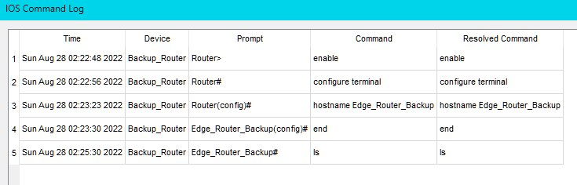

# Objectives

### Part 1: Investigate the Bottom Toolbar

### Part 2: Investigate Devices in a Wiring Closet

### Part 3: Connect End Devices to Networking Devices

### Part 4: Install a Backup Router

### Part 5: Configure a Hostname

### Part 6: Explore the Rest of the Network

## Background / Scenario

The network model in this Packet Tracer Physical Mode (PTPM) activity incorporates many of the technologies that you can master in Cisco Networking Academy courses. It represents a simplified version of how a small to medium-sized business network might look.

Most of the devices in the Seward branch office and Warrenton data center are already deployed and configured. You have just been hired to review the devices and networks deployed. It is not important that you understand everything you see and do in this activity. Feel free to explore the network on your own. If you wish to proceed more systematically, follow the steps below. Answer the questions to the best of your ability.

Note: This activity opens in and focuses on Physical mode. Many of the Packet Tracer activities you encounter in Cisco Networking Academy courses will use Logical mode. You can switch between these modes at any time to compare the differences by clicking the Logical (Shift+L) and Physical (Shift+P) buttons. However, in other activities in this course you may be locked out of one mode or the other.

# Instructions

## Part 1: Investigate the Bottom Toolbar:

The icon toolbar at the bottom left-hand corner has various categories of networking components. You should see categories that correspond to Network Devices, End Devices, and Components. The fourth category (with the lightning bolt icon) is Connections and represents the networking media supported by Packet Tracer. The last two categories are Miscellaneous and Multiuser Connection.

What are the subcategories for Network Devices?
**Screenshot: Toolbar Network Devices**


## Part 2: Investigate Devices in a Wiring Closet:

a. If you went exploring, return to Physical mode and Intercity now. In the top blue bar, click Physical, and then use the Navigation Panel or Back level buttons to navigate to Intercity.

b. Click Seward, and then click the Branch Office.

c. Click the Branch Office Wiring Closet. Notice that the wiring closet has a Rack, a Cable Pegboard, a Table, and a Shelf.

The Rack contains devices that can be racked mounted. If you zoom in on the rack (zoom tool or Ctrl+scroll wheel), you can see that the devices are screwed in (mounted) in the rack. Below the power distribution device, you will find a router. Routers connect different networks.

d. Below the router are two switches. These switches provide wired connections to connect to other devices. Notice that the devices have a name assigned by the network administrator. What devices use a wired connection to connect to switch ALS2?

e. Below the switches in the Rack is a wireless access point named Access_Point. Wireless access points use a wireless connection to connect to other devices. Switch to Logical Mode. Which device is connected to Access_Point?

f. Switch to Physical mode. You should be back in the Branch Office Wiring Closet. Where is the device connected to Access_Point physically located?

Part 3: Connect End Devices to Networking Devices
Devices can be connected in a variety of ways. For network connectivity, devices are typically connected using either a copper straight-through cable or wirelessly. For management connectivity, devices are typically connected using either a console cable or USB cable.

Note: Packet Tracer will grade the rest of this activity. At any time, you can click Check Results at the bottom of the Tasks window. Then click Assessment Items to see which items you have not yet completed.

a. Investigate the Cable Pegboard. It includes two Console cables, ten Copper Straight-Through cables, four Fiber cables, two Coaxial cables, and two USB cables. Notice that the cable representations in Physical mode are more representative of their real-world counterparts. Switch to Logical mode. Notice that the cable representations are different in this mode.

b. Switch to Physical mode. Click a Copper Straight-Through cable from the Cable Pegboard.

c. Float your mouse over the ports on PC_1 until you see the FastEthernet0 popup. The other RS232 port is for connecting Console cables.

d. With the Copper Straight-Through cable still selected, click the FastEthernet0 port to connect the cable. The port should now be highlighted in green.

e. Connect the other end of the cable to the ALS2 switch by clicking an empty Fast Ethernet port. The cable should now be dangling between PC_1 and the ALS2 port.

f. PCs and laptops can also be connected to networking devices using a console cable or a USB cable. This connection provides management access. Click a Console cable from the Cable Pegboard.

g. Click the RS232 port on PC_1. The port should now be highlighted in green.

h. Float your mouse over the Edge_Router and find the Console port. You can right-click > Inspect Front to zoom in and make finding the port easier.

i. Click the Console port on Edge_Router to connect the Console cable. The cable should now be dangling between PC_1 and the Console port on the Edge_Router.

## Part 4: Install a Backup Router:

Newer models of networking devices can be accessed through a USB port for management configuration. This is necessary because newer laptops and PCs typically do not include an RS232 port for console cable connections.

a. Investigate the Shelf. This includes an inventory of devices in the Seward Branch Office that are not currently installed.

b. Click and drag the Backup_Router to an empty spot in the Rack.

c. Some devices are not automatically powered on when installed in the Rack. Click Backup_Router > Inspect Rear. Find the power button and turn the router on.

d. On the Cable Pegboard, choose a USB cable. Return to the rear view of Backup_Router and find the USB Console port on the far left. Click the port to connect the USB cable. The port should now be highlighted in green.

e. Connect the other end of the USB cable to either of the USB ports on Laptop_1. The cable will not dangle like the cables did for the connections to PC_1.

## Part 5: Configure a Hostname:

Network administrators typically assign a name to networking devices. To do this, you will use your console connection to the Backup_Router.

a. Click Laptop_1 > Desktop tab > Terminal.

b. The Terminal Configuration is already set with the necessary port configuration. Click OK.

c. You are now at the command line for Backup_Router and should see the following.

```terminal
<output omitted>

cisco ISR4331/K9 (1RU) processor with 1795999K/6147K bytes of memory.

Processor board ID FLM232010G0

3 Gigabit Ethernet interfaces

2 Serial interfaces

32768K bytes of non-volatile configuration memory.

4194304K bytes of physical memory.

3207167K bytes of flash memory at bootflash:.

0K bytes of WebUI ODM Files at webui:.


--- System Configuration Dialog ---


Would you like to enter the initial configuration dialog? [yes/no]: no
```

d. Answer no to the question and then press ENTER to get the Router> command prompt.

```terminal
Press RETURN to get started!


<ENTER>


Router>
```

e. Enter the following commands to name the router Edge_Router_Backup.

```terminal
Router> enable

Router# configure terminal

Enter configuration commands, one per line. End with CNTL/Z.

Router(config)# hostname Edge_Router_Backup

Edge_Router_Backup(config)# end

Edge_Router_Backup#
```

Notice that the hostname changed from Router to Edge_Router_Backup.

f. Close the Laptop_1 window and return to the Branch Office Wiring Closet.

g. Notice that the display name for Backup_Router did not change. Click Backup_Router > Config tab. In Global Settings, notice that Packet Tracer maintains two names for the device: a Display Name and a Hostname.

Part 6: Explore the Rest of the Network
Take some time to explore the rest of the network. Become familiar with the network representations in both Logical and Physical modes. In Physical mode, navigate to other areas such as the Wellington Data Center and Teleworker Home. The technologies used in these locations are discussed in greater detail in Cisco Networking Academy courses. For now, see what you can discover on your own. Don't worry about breaking anything. You can always close Packet Tracer and open a fresh copy to start exploring again.

**Screenshot: Completed Configuration**


**Screenshot: Command Logs**



**Packet Tracer File:**

You can download and open the Packet Tracer simulation file for this module using the link below:

[Download Module1 Packet Tracer File](PacketTracer-Files\1.0.5-packet-tracer---logical-and-physical-mode-exploration.pkz)
