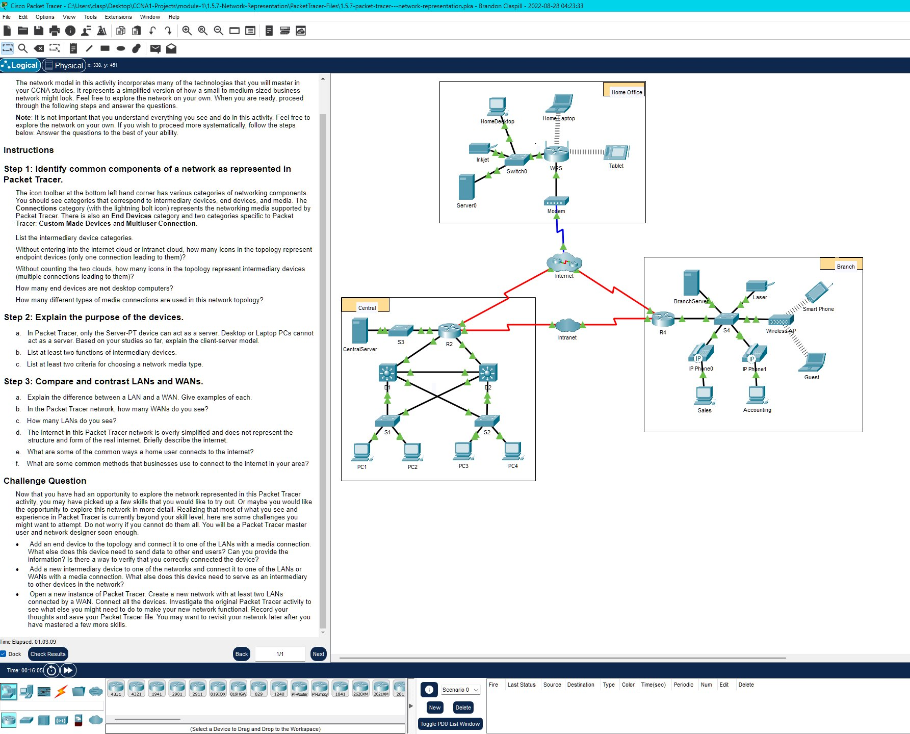

# Packet Tracer - Network Representation

## Objectives

The network model in this activity incorporates many of the technologies that you will master in your CCNA studies. It represents a simplified version of how a small to medium-sized business network might look. Feel free to explore the network on your own. When you are ready, proceed through the following steps and answer the questions.

Note: It is not important that you understand everything you see and do in this activity. Feel free to explore the network on your own. If you wish to proceed more systematically, follow the steps below. Answer the questions to the best of your ability.

# Instructions

### Step 1: Identify common components of a network as represented in Packet Tracer:

The icon toolbar at the bottom left hand corner has various categories of networking components. You should see categories that correspond to intermediary devices, end devices, and media. The Connections category (with the lightning bolt icon) represents the networking media supported by Packet Tracer. There is also an End Devices category and two categories specific to Packet Tracer: Custom Made Devices and Multiuser Connection.

Questions:
List the intermediary device categories.

```text
Routers, Switches, Hubs, Wireless Devices, and WAN Emulation
```

Without entering into the internet cloud or intranet cloud, how many icons in the topology represent endpoint devices (only one connection leading to them)?

```text
15
```

Without counting the two clouds, how many icons in the topology represent intermediary devices (multiple connections leading to them)?

````text
11```

How many end devices are not desktop computers?
```text
8```
How many different types of media connections are used in this network topology?
```text
4```

### Step 2: Explain the purpose of the devices:
Questions:
A.     In Packet Tracer, only the Server-PT device can act as a server. Desktop or Laptop PCs cannot act as a server. Based on your studies so far, explain the client-server model.
```text
In today's networks, a computer can be like a customer, a worker, or even both at the same time. It all depends on the special programs installed on that computer. Computers with special programs that give them the job of providing things like emails or web pages to other computers are called "servers." On the other hand, computers with different programs that allow them to ask for and show the information from the server are called "clients." Surprisingly, a computer that's usually a client can become a server too, just by adding the right program.
````

B. List at least two functions of intermediary devices.

```text
Signal Boosting and Routing: Intermediary devices help boost and resend data signals to ensure they travel smoothly across the network. They also keep track of available pathways in the network, guiding data to its destination. This helps maintain efficient communication.

Error Handling and Security: These devices monitor the network for errors and issues. When they detect a problem, they inform other devices about it. Additionally, they can redirect data along backup paths in case of a connection problem. Intermediary devices also control the flow of data based on security settings, allowing or blocking data as needed.
```

C. List at least two criteria for choosing a network media type.

```text
How Far the Signal Can Travel: Think about how long the material can effectively carry the signal. You want the signal to reach the intended destination without weakening too much.

Where the Material Will Be Used: Consider the place where you're putting the material. Different environments might need different materials. For example, something used outdoors might need to withstand weather conditions.

These factors help decide what material to pick, making sure the data travels well, and the setup is reliable.
```

### Step 3: Compare and contrast LANs and WANs:

Questions:
A. Explain the difference between a LAN and a WAN. Give examples of each.

```text
A LAN and a WAN are like two different sizes of networks. A LAN is a network that covers a small area, like a home office or a school campus. It's for connecting devices and people in a small space.

A WAN is like a network that covers a big area, even if it's far apart. It can span from a few miles to even thousands of miles. Imagine connecting people from different cities or countries.

LANs are for small places like your home or school.
WANs are for big areas that can be really far apart.

Examples:

LAN: A school's computer lab or the computers in your house.
WAN: The whole internet that connects people from around the world, or a network that connects different offices of a big company even if they're in different cities.
```

B. In the Packet Tracer network, how many WANs do you see?

```text
There are two: the Internet and the Intranet WANs.
```

C. How many LANs do you see?

```text
There are three, easily identifiable because each has a border and label.
```

D. The internet in this Packet Tracer network is overly simplified and does not represent the structure and form of the real internet. Briefly describe the internet.

```text
Think of the Internet as a giant network of networks. When we want to talk to something on a different network, like a website or a server, we use the Internet. It's like a big web of connected networks from all over the world.
```

E. What are some of the common ways a home user connects to the internet?

```text
Cable, DSL, dial-up, cellular, and satellite.
```

F. What are some common methods that businesses use to connect to the internet in your area?

```text
Dedicated leased line, Metro-E, DSL, Cable, Satellite
```

## Challenge Question:

Now that you have had an opportunity to explore the network represented in this Packet Tracer activity, you may have picked up a few skills that you would like to try out. Or maybe you would like the opportunity to explore this network in more detail. Realizing that most of what you see and experience in Packet Tracer is currently beyond your skill level, here are some challenges you might want to attempt. Do not worry if you cannot do them all. You will be a Packet Tracer master user and network designer soon enough.

· Add an end device to the topology and connect it to one of the LANs with a media connection. What else does this device need to send data to other end users? Can you provide the information? Is there a way to verify that you correctly connected the device?

· Add a new intermediary device to one of the networks and connect it to one of the LANs or WANs with a media connection. What else does this device need to serve as an intermediary to other devices in the network?

· Open a new instance of Packet Tracer. Create a new network with at least two LANs connected by a WAN. Connect all the devices. Investigate the original Packet Tracer activity to see what else you might need to do to make your new network functional. Record your thoughts and save your Packet Tracer file. You may want to revisit your network later after you have mastered a few more skills.

**Screenshot: Packet Tracer Representation**



**Packet Tracer File:**

You can download and open the Packet Tracer simulation file for this module using the link below:

[Download Module1 Packet Tracer File](PacketTracer-Files\1.5.7-Network-representation.pka)
