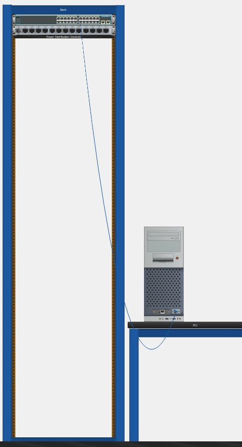
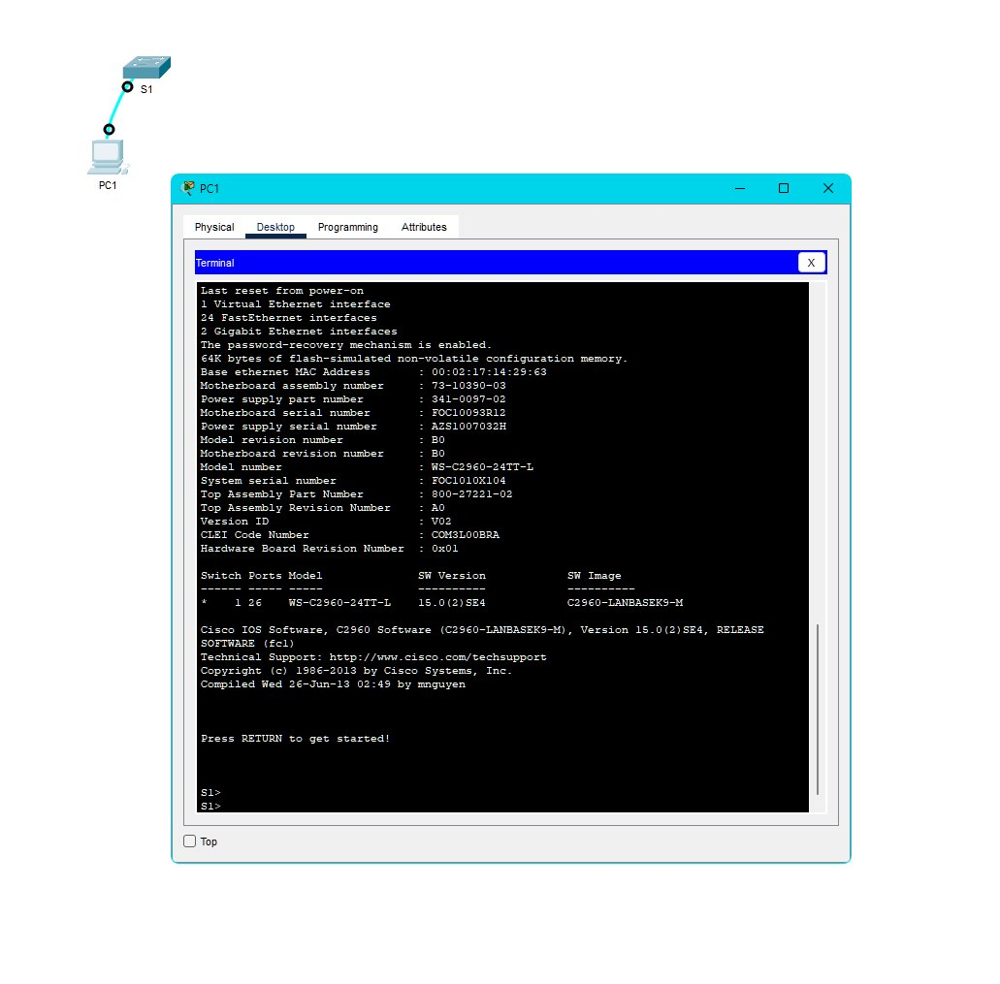

# Packet Tracer - Navigate the IOS

## Objectives

### Part 1: Establish Basic Connections, Access the CLI, and Explore Help

### Part 2: Explore EXEC Modes

### Part 3: Set the Clock

## Background / Scenario

In this activity, you will practice skills necessary for navigating the Cisco IOS, such as different user access modes, various configuration modes, and common commands used on a regular basis. You will also practice accessing the context-sensitive Help by configuring the clock command.

# Instructions

## Part 1: Establish Basic Connections, Access the CLI, and Explore Help

### Step 1: Connect PC1 to S1 using a console cable

A.     Click the Connections icon (the one that looks like a lightning bolt) in the lower left corner of the Packet Tracer window.

B.     Select the light blue Console cable by clicking it. The mouse pointer will change to what appears to be a connector with a cable dangling from it.

C.     Click PC1. A window displays an option for an RS-232 connection. Connect the cable to the RS-232 port.

D.     Drag the other end of the console connection to the S1 switch and click the switch to access the connection list.

E.     Select the Console port to complete the connection.

**Screenshot: Basic Connection**



### Step 2: Establish a terminal session with S1

A.     Click PC1 and then select the Desktop tab.

B.     Click the Terminal application icon. Verify that the Port Configuration default settings are correct.

#### Question

What is the setting for bits per second?

```text
9600
```

C.     The screen that appears may have several messages displayed. Somewhere on the screen there should be a Press RETURN to get started! message. Press ENTER.

#### Question

What is the prompt displayed on the screen?

```console
S1>
```

**Screenshot: Terminal Session**



### Step 3: Explore the IOS Help

A.     The IOS can provide help for commands depending on the level accessed. The prompt currently displayed is called User EXEC, and the device is waiting for a command. The most basic form of help is to type a question mark (?) at the prompt to display a list of commands.

Open Configuration Window

```console
S1> ?
```

#### Question

Which command begins with the letter ‘C’?

```text
Connect
```

B.     At the prompt, type t and then a question mark (?).

```console
S1> t?
```

Which commands are displayed?
```text
telnet terminal traceroute
```

#### Question


At the prompt, type te and then a question mark (?).

```console
S1> te?
```

Which commands are displayed?

```text
telnet terminal
```

This type of help is known as context-sensitive help. It provides more information as the commands are expanded.

## Part 2: Explore EXEC Modes

In Part 2 of this activity, you will switch to privileged EXEC mode and issue additional commands

### Step 1: Enter privileged EXEC mode.

A.     At the prompt, type the question mark (?).

```console
S1> ?
```

#### Question:

What information is displayed for the <enable> command?

```text
Turn on privileged commands
```

B.     Type en and press the Tab key.

```console
S1> en<Tab>
```

What displays after pressing the Tab key?

```text
enable
```

This is called command completion (or tab completion). When part of a command is typed, the Tab key can be used to complete the partial command. If the characters typed are enough to make the command unique, as in the case of the enable command, the remaining portion of the command is displayed.

#### Question:

What would happen if you typed te<Tab> at the prompt?

```text
When you type "te" and press Tab, the system realizes that there are multiple commands that start with "te." Since "te" isn't enough to tell the system which specific command you want, it won't automatically complete the command. Instead, it will show you all the possible commands that begin with "te" and wait for you to type more characters to uniquely identify the command you're looking for.
```

C.     Enter the enable command and press ENTER.

#### Question:
How does the prompt change?

```text
It changes from S1> to S1#, which indicates privileged EXEC mode.
```

D.     When prompted, type the question mark (?).

```console
S1# ?
```

One command starts with the letter ‘C’ in user EXEC mode.

#### Question:

How many commands are displayed now that privileged EXEC mode is active? (Hint: you could type c? to list just the commands beginning with ‘C’.)

```text
5 – clear, clock, configure, connect, and copy
```

### Step 2: Enter Global Configuration mode

A.     When in privileged EXEC mode, one of the commands starting with the letter ‘C’ is configure. Type either the full command or enough of the command to make it unique. Press the <Tab> key to issue the command and press ENTER.

```console
S1# configure
```

#### Question:

What is the message that is displayed?

```console
Configuring from terminal, memory, or network [terminal]?
```

B.     Press Enter to accept the default parameter that is enclosed in brackets [terminal].

#### Question:

How does the prompt change?

```console
S1(config)#
```

C.     This is called global configuration mode. This mode will be explored further in upcoming activities and labs. For now, return to privileged EXEC mode by typing end, exit, or Ctrl-Z.

```console
S1(config)# exit

S1#
```

## Part 3: Set the Clock

### Step 1: Use the clock command.

A.     Use the clock command to further explore Help and command syntax. Type show clock at the privileged EXEC prompt.

```console
S1# show clock
```

#### Question:

What information is displayed? What is the year that is displayed?

```terminal
UTC Mon Mar 1 1993 preceded by the hours, minutes, and seconds since the device started. The year is 1993.```

B.     Use the context-sensitive help and the clock command to set the time on the switch to the current time. Enter the command clock and press ENTER.

```console
S1# clock<ENTER>
```

#### Question

What information is displayed?

```console
% Incomplete command
```

C.     The “% Incomplete command” message is returned by the IOS. This indicates that the clock command needs more parameters. Any time more information is needed, help can be provided by typing a space after the command and the question mark (?).

```console
S1# clock ?
```

#### Question:

What information is displayed?

```terminal
set Set the time and date
```

D.     Set the clock using the <clock set> command. Proceed through the command one step at a time.

```console
S1# clock set ?
```

#### Questions:

What information is being requested?

```terminal
hh:mm:ss Current Time
```

What would have been displayed if only the <clock set> command had been entered, and no request for help was made by using the question mark?

```terminal
% Incomplete command
```

e.     Based on the information requested by issuing the <clock set ?> command, enter a time of 3:00 p.m. by using the 24-hour format of 15:00:00. Check to see if more parameters are needed.

```console
S1# clock set 15:00:00 ?
```

The output returns a request for more information:

```console
<1-31> Day of the month


MONTH Month of the year
```

F.      Attempt to set the date to 01/31/2035 using the format requested. It may be necessary to request additional help using context-sensitive help to complete the process. When finished, issue the <show clock> command to display the clock setting. The resulting command output should display as:

```console
S1# show clock
```

```terminal
*15:00:04.869 UTC Tue Jan 31 2035
```

G.     If you were not successful, try the following command to obtain the output above:

```console
S1# clock set 15:00:00 31 Jan 2035
```

### Step 2: Explore additional command messages.

a.     The IOS provides various outputs for incorrect or incomplete commands. Continue to use the <clock> command to explore additional messages that may be encountered as you learn to use the IOS.

b.     Issue the following commands and record the messages:

```console
S1# cl<tab>
```

#### Questions:

What information was returned?

```terminal
% Ambiguous command: “cl”
```

```console
S1# clock
```

#### Question:

What information was returned?

```terminal
% Incomplete command
```

```console
S1# clock set 25:00:00
```

#### Question:

What information was returned?

```terminal
S1#clock set 25:00:00
^
% Invalid input detected at '^' marker.
S1# clock set 15:00:00 32
```

```console
S1# clock set 15:00:00 32
```

#### Question:

What information was returned?

```terminal
S1#clock set 15:00:00 32
^
% Invalid input detected at '^' marker.
```
