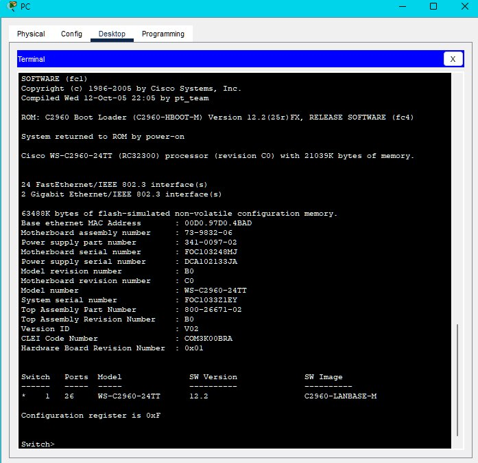

# Packet Tracer - Navigate the IOS Using a Terminal Client for Console Connectivity - Physical Mode

## Objectives

### Part 1: Access a Cisco Switch through the Serial Console Port

### Part 2: Display and Configure Basic Device Settings

### Part 3: Access a Cisco Router Using a Mini-USB Console Cable

## Background / Scenario

Various models of Cisco routers and switches are used in all types of networks. These devices are managed using a local console connection or a remote connection. Nearly all Cisco devices have a serial console port to which you can connect. Newer models also have a USB console port.

In this Packet Tracer Physical Mode (PTPM) activity, you will learn how to access a Cisco device via a direct local connection to the console port, using the generic terminal emulation program in Packet Tracer. After you have established a console connection with the Cisco device, you can display or configure device settings. In this activity, you will only display settings and configure the clock in this lab.

# Instructions

### Part 1: Access a Cisco Switch through the Serial Console Port

In this part, you will connect a PC to a Cisco switch using a rollover console cable. This connection will allow you to access the CLI and display settings and configure the switch.

### Step 1: Install and investigate a 2960 switch.

A.     There are several switches, routers, and other devices on the Shelf. Click and drag the 2960 to the Rack. In Packet Tracer, most devices that you drag to the Rack or the Table are automatically connected to power. Some devices require that you turn on the power. However, a 2960 switch powers up as soon as you move it to the Rack.

B.     Right click the 2960 switch and select Inspect Front. Use the zoom tool to get a better view. Notice that there are 24 ports to connect users and two additional ports to connect the switch to other switches or routers.

C.     Click the X to close the Inspect Front view.

D.     Right click the 2960 switch and select Inspect Rear. Use the zoom tool to get a better view. Notice that there is a CONSOLE port for connecting a rollover cable to a PC.

E.     Click the X to close the Inspect Rear View.

### Step 2: Install and investigate the PC.

A.     Click and drag the PC to the Table.

B.     Right click the PC and select Inspect Front. Click the red power button to turn on the PC. You should now see a green light on the front of the PC. At the bottom of the PC, notice that there is a Fast Ethernet interface. Next to it is an RS 232 port for connecting a rollover cable. Below these are two USB ports that can also be used for console access.

### Step 3: Connect the switch and PC using a rollover console cable.

A.     On the Cable Pegboard, click a blue rollover console cable.

B.     On the PC, click the R2 232 port.

C.     Right click the 2960 switch and choose Inspect Rear.

D.     Click the CONSOLE port to connect the rollover console cable.

### Step 4: Configure the Packet Tracer Terminal program to establish a console session with the switch.

Terminal is a terminal emulation program that was created specifically for Packet Tracer. This program allows you to access the terminal output of the switch. It also allows you to configure the switch.

a.     Click PC > Desktop tab > Terminal. The default parameters for the console port are 9600 baud, 8 data bits, no parity, 1 stop bit, and no flow control. The Terminal default settings match the console port settings for communications with the Cisco IOS on the switch.

b.     Click OK. The last line in the terminal output should be Press RETURN to get started!.

c.     Press the ENTER key to get to the User EXEC mode switch prompt.

```console
Open Configuration Window

Cisco IOS Software, C2960 Software (C2960-LANBASE-M), Version 12.2(25)FX, RELEASE SOFTWARE (fc1)

Copyright (c) 1986-2005 by Cisco Systems, Inc.

Compiled Wed 12-Oct-05 22:05 by pt_team

 

Press RETURN to get started!

<ENTER>

 

 

Switch>
```

## Part 2: Display and Configure Basic Device Settings

In this part, you are introduced to the user and privileged EXEC modes. You will determine the IOS version, display the clock settings, and configure the clock on the switch.

### Step 1: Display the switch IOS image version.

While you are in the user EXEC mode, use the show version command to display the IOS version for the switch.

```console
Switch> show version
```

#### Question:

Which IOS image and version is currently in use by the switch?

**Screenshot: Show Version**



### Step 2: Configure the clock.

As you learn more about networking, you will see that configuring the correct time on a Cisco switch will be helpful when you are troubleshooting problems. The following steps let you manually configure the internal clock of the switch.

A.     Display the current clock settings.

```terminal
Switch> show clock

*00:30:05.261 UTC Mon Mar 1 1993
```

B.     You must be in privileged EXEC mode to change the clock settings. To enter the privileged EXEC mode, type enable at the user EXEC mode prompt.

```console
Switch> enable
```

C.     Configure the clock setting. The question mark (?) provides help and allows you to determine the expected input for configuring the current time, date, and year. Press Enter to complete the clock configuration.

```terminal
Switch# clock set ?

hh:mm:ss Current Time
```

```terminal
Switch# clock set 15:28:00 ?

<1-31> Day of the month

MONTH Month of the year
```

```console
Switch# clock set 15:28:00 Nov 11 ?

<1993-2035> Year
```

```console
Switch# clock set 15:28:00 Nov 11 2020
```

D.     Enter the show clock command to verify that the clock setting has updated.

```console
Switch# show clock

15:28:44.687 UTC Wed Nov 11 2020

Switch#
```

Close Configuration Window

## Part 3: Access a Cisco Router Using a Mini-USB Console Cable
In this part, you will install a 4321 router and connect a laptop to the console using a mini-USB cable.

### Step 1: Install and investigate a 4321 router.

A.     Locate the 4321 router on the Shelf. Click and drag the 4321 router to the Rack.

B.     Right click the 4321 router and select Inspect Front. Use the zoom tool to get a better view. Notice that there is a power switch on the left. Click it to turn on the router. Also notice the other ports that are available. There is an RJ-45 and a mini-USB port for console connectivity.

C.     Click the X to close the Inspect Front view.

### Step 2: Install and investigate the Laptop.

A.     Click and drag the Laptop to the Table.

B.     Right click the Laptop and select Inspect Front. Click the power button on the far left to turn the laptop on. You should now see a green light. Notice that there are two RJ-45 ports: one for RS 232 and another for Fast Ethernet. There are also two USB ports. You can use either of these to connect to the mini-USB port on the 4321 router.

C.     Click the X to close the Inspect Front view.

### Step 3: Connect the router and laptop using a mini-USB cable.

A.     On the Cable Pegboard, click a mini-USB cable.

B.     On the Laptop, click a mini-USB port.

C.     Click the mini-USB port on the 4321 router. You may want to right click and select Inspect Front to get a closer view.

### Step 4: Configure the Packet Tracer Terminal program to establish a console session with the switch.

A.     Click Laptop > Desktop tab > Terminal. The Terminal default settings match the console port settings for communications with the Cisco IOS on the switch.

B.     After the router has completed its startup process, the following message is displayed. Enter <n> to continue.

Open Configuration Window

```console
Initializing Hardware ...

 

<output omitted>

 

cisco ISR4321/K9 (1RU) processor with 1687137K/6147K bytes of memory.

Processor board ID FLM2041W2HD

2 Gigabit Ethernet interfaces

32768K bytes of non-volatile configuration memory.

4194304K bytes of physical memory.

3223551K bytes of flash memory at bootflash:.

 

 

 

--- System Configuration Dialog ---

 

Would you like to enter the initial configuration dialog? [yes/no]: no
```

C.     Press the <ENTER> key to get to the User EXEC mode router prompt.

```console
Press RETURN to get started!

 

 

 

Router>
```

Open Configuration Window

## Reflection Question

### 1.     How do you prevent unauthorized personnel from accessing the Cisco device through the console port?

```text
Physically secure the device and use password protection on the console port.
```

### 2.     What are the advantages and disadvantages of using the serial console connection compared to the USB console connection to a Cisco router or switch?

```text
The choice between using a serial console connection and a USB console connection for connecting to a Cisco router or switch depends on the available ports on your computer and the device itself.

If your computer has a serial port and you have a specific cable called a DB9-to-RJ45 cable, it's generally easier to use the serial console connection to link to the router or switch. This kind of connection can be established directly if the appropriate cable is available.

However, if your computer lacks a serial port, you can still make a connection by using a third-party device called a USB-to-Serial adapter. This adapter lets you link your computer's USB port to the device's serial console port.

It's worth noting that while Cisco routers don't usually have mini-USB console ports, some newer models do. If your Cisco router has a mini-USB console port and you're frequently connecting to it, this can be a very effective approach, particularly once you've installed the necessary Cisco drivers. The advantage is that most newer computers come with USB ports, making it a convenient option. However, for Cisco switches, the option to connect via USB is not usually available.

So, the choice between serial and USB console connections depends on factors such as the availability of the appropriate ports on your devices and your computer, and whether your Cisco router has a mini-USB console port.
```