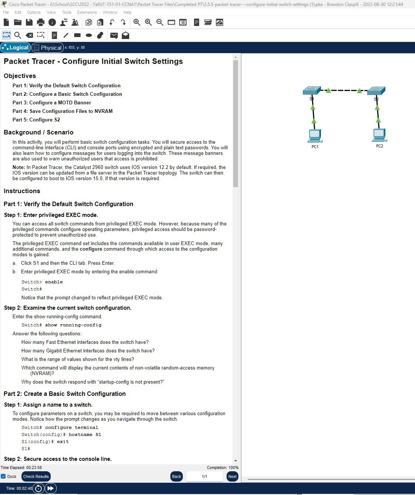
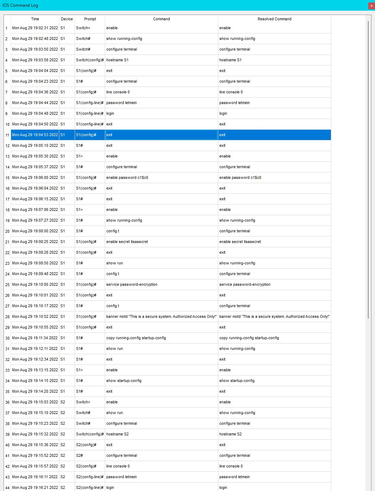

In this activity, you will perform basic switch configurations. You will secure access to the CLI and console ports using encrypted and plaintext passwords. You will learn how to configure messages for users logging into the switch. These banners are also used to warn unauthorized users that access is prohibited.

## Part 1: Verify the Default Switch Configuration

Step 1. Enter Privileged EXEC Mode:

```text
Switch> enable
Switch#
```

Step 2. Examines the Current Configuration Of The Switch:

```text
Switch# show running-config
```

## Part 2: Create a Basic Switch Configuration

Step 1. Assign a Device Name To The Switch:

```text
Switch# configure terminal
Switch(config)# hostname S1
S1(config)# exit
S1#
```

Step 2. Secure Access To The Console Line:

```text
S1# configure terminal
Enter configuration commands, one per line. End with CNTL/Z.
S1(config)# line console 0
S1(config-line)# password letmein
S1(config-line)# login
S1(config-line)# exit
S1(config)# exit
%SYS-5-CONFIG_I: Configured from console by console
S1#
```

Step 3. Verify That Console Access Is Secured:

```text
S1# exit
Switch con0 is now available
Press RETURN to get started.
User Access Verification
Password:
S1>
```

Step 4. Secure Privileged Mode Access:

```text
S1> enable
S1# configure terminal
S1(config)# enable password c1$c0
S1(config)# exit
%SYS-5-CONFIG_I: Configured from console by console
S1#
```

Step 5: Verify that privileged mode access is secure:

```text
S1> exit
%SYS-5-CONFIG_I: Configured from console by console
S1 con0 is now available
Press RETURN to get started.
User Access Verification
Password: CISCO
S1#
S1# show running-config
```

Step 6: Configure an encrypted password to secure access to privileged mode:

```text
S1# config t
S1(config)# enable secret itsasecret
S1(config)# exit
S1#
```

Step 7: Verify that the enable secret password is added to the configuration file:

```text
S1# show running-config
```

Step 8: Encrypt the enable and console passwords:

```text
S1# config t
S1(config)# service password-encryption
S1(config)# exit
S1#
```

## Part 3: Configure a MOTD Banner

Step 1: Configure a message of the day (MOTD) banner:

```text
S1# config t
S1(config)# banner motd "This is a secure system. Authorized Access Only!"
S1(config)# exit
%SYS-5-CONFIG_I: Configured from console by console
S1#
```

## Part 4: Save and Verify Configuration Files to NVRAM

Step 1: Verify that the configuration is accurate using the show run command.

```text
S1# copy running-config startup-config
Destination filename [startup-config]?[Enter]
Building configuration...
[OK]
S1#
```

## Part 5: Configure S2

```text
a. Device name: S2
b. Protect access to the console using the letmein password.
c. Configure an enable password of c1$c0 and an enable secret password of itsasecret.
d. Configure an appropriate message to those logging into the switch.
e. Encrypt all plain text passwords.
f. Ensure that the configuration is correct.
g. Save the configuration file to avoid loss if the switch is powered down
```

**Screenshot: Completed Configuration**



**Screenshot: Command Logs**




**Packet Tracer File:**

You can download and open the Packet Tracer simulation file for this module using the link below:

[Download Module1 Packet Tracer File](Packet-Tracer-File\2.5.5-packet-tracer---configure-initial-switch-settings.pkz)
