<<<<<<< HEAD
# Packet Tracer - Implement Basic Connectivity

## Adressing Table

**Screenshot: Adress Table**

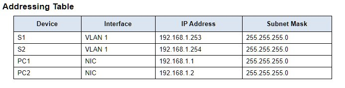

## Objectives

### Part 1: Perform a Basic Configuration on S1 and S2

### Part 2: Configure the PCs

### Part 3: Configure the Switch Management Interface

Background
In this activity, you will first create a basic switch configuration. Then, you will implement basic connectivity by configuring IP addressing on switches and PCs. When the IP addressing configuration is complete, you will use various <show> commands to verify the configuration and use the <ping> command to verify basic connectivity between devices.

# Instructions:

## Part 1: Perform a Basic Configuration on S1 and S2:

Complete the following steps on S1 and S2.

### Step 1: Configure S1 with a hostname:

A.     Click S1 and then click the CLI tab.

B.     Enter the correct command to configure the hostname as S1.

### Step 2: Configure the console and encrypted privileged EXEC mode passwords:

A.     Use cisco for the console password.

B.     Use class for the privileged EXEC mode password.

### Step 3: Verify the password configurations for S1:

**Screenshot: Access Password**

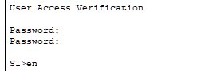

## Question: How can you verify that both passwords were configured correctly?

```text
To confirm that both passwords were set correctly, you'll notice two prompts when you leave user EXEC mode. The switch asks for a password when entering the console interface and again for the privileged EXEC mode. To double-check, you can use the "show run" command to see the passwords in the configuration.
```

Use an appropriate banner text to warn unauthorized access. The following text is an example:

<Authorized access only. Violators will be prosecuted to the full extent of the law.>


**Screenshot: Unauthorized Access**

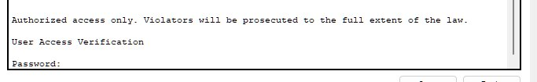

### Step 4: Save the configuration file to NVRAM.

## Question: Which command do you issue to accomplish this step?

```terminal
S1(config)# exit (or end)
S1# copy run start
Destination filename [startup-config]?
Building configuration...
[OK]
S1#
```

### Step 5: Repeat Steps 1 to 5 for S2:

## Part 2: Configure the PCs:

Configure PC1 and PC2 with IP addresses.

### Step 1: Configure both PCs with IP addresses.

A.     Click PC1 and then click the Desktop tab.

B.     Click IP Configuration. In the Addressing Table above, you can see that the IP address for PC1 is 192.168.1.1 and the subnet mask is 255.255.255.0. Enter this information for PC1 in the IP Configuration window.

**Screenshot: PC-1 IP Configuration**

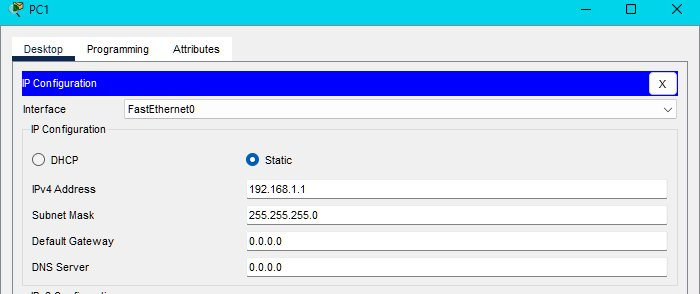

C.     Repeat steps 1a and 1b for PC2.

**Screenshot: PC-2 IP Configuration**

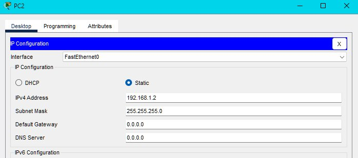

### Step 2: Test connectivity to switches.

A.     Click PC1. Close the IP Configuration window if it is still open. In the Desktop tab, click Command Prompt.

B.     Type the <ping> command and the IP address for S1 and press Enter.

```terminal
Packet Tracer PC Command Line 1.0

PC> ping 192.168.1.253

```


## Question: Were you successful? Explain.

```text
The ping is unsuccessful because the switches have not been confiured with an IP address.
```

## Part 3: Configure the Switch Management Interface:

Configure S1 and S2 with an IP address.

### Step 1: Configure S1 with an IP address.

Switches can be used as plug-and-play devices. This means that they do not need to be configured for them to work. Switches forward information from one port to another based on MAC addresses.

## Question: If this is the case, why would we configure it with an IP address?

```text
In order for you to connect remotely to a switch, you need to assign it an IP address. The default configuration on the switch is to have the management of the switch controlled through VLAN 1.
```

Use the following commands to configure S1 with an IP address.

```terminal
S1# configure terminal

Enter configuration commands, one per line. End with CNTL/Z.

S1(config)# interface vlan 1

S1(config-if)# ip address 192.168.1.253 255.255.255.0

S1(config-if)# no shutdown

%LINEPROTO-5-UPDOWN: Line protocol on Interface Vlan1, changed state to up

S1(config-if)#

S1(config-if)# exit

S1#
```

## Question: Why do you enter the <no shutdown> command?

```text
The no shutdown command administratively places the interface in an active state.
```

### Step 2: Configure S2 with an IP address.

Use the information in the Addressing Table to configure S2 with an IP address.

### Step 3: Verify the IP address configuration on S1 and S2.

Use the <show ip interface brief> command to display the IP address and status of all the switch ports and interfaces. You can also use the <show running-config> command.

### Step 4: Save configurations for S1 and S2 to NVRAM.

## Question: Which command is used to save the configuration file in RAM to NVRAM?

```command
copy running-config startup-config
```

### Step 5: Verify network connectivity.

Network connectivity can be verified using the <ping> command. It is very important that connectivity exists throughout the network. Corrective action must be taken if there is a failure. Ping S1 and S2 from PC1 and PC2.

A.     Click PC1 and then click the Desktop tab.

B.     Click Command Prompt.

C.     Ping the IP address for PC2.

D.     Ping the IP address for S1.

**Screenshot: PC-1 Ping S1**

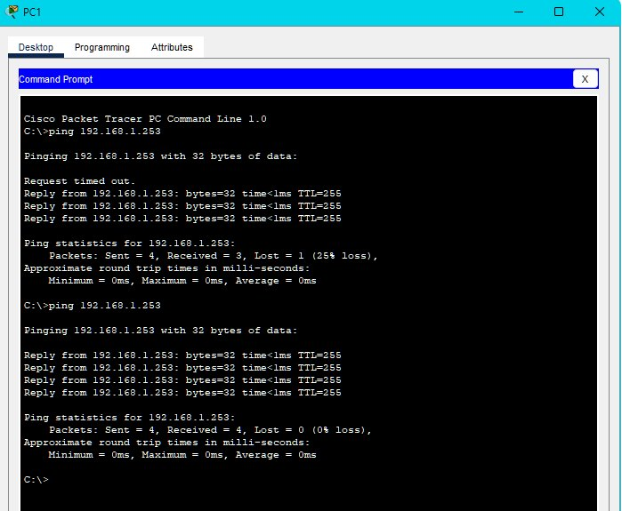

E.     Ping the IP address for S2.

Note: You can also use the ping command on the switch CLI and on PC2.

**Screenshot: PC-2 Ping **

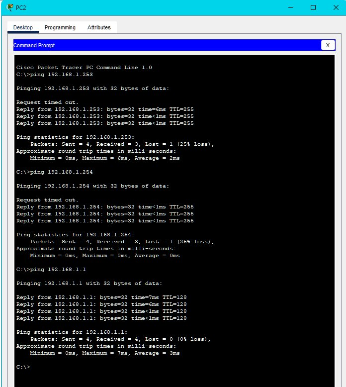

All pings should be successful. If your first ping result is 80%, try again. It should now be 100%. You will learn why a ping may sometimes fail the first time later in your studies. If you are unable to ping any of the devices, recheck your configuration for errors.

**Screenshot: Commands-1 **

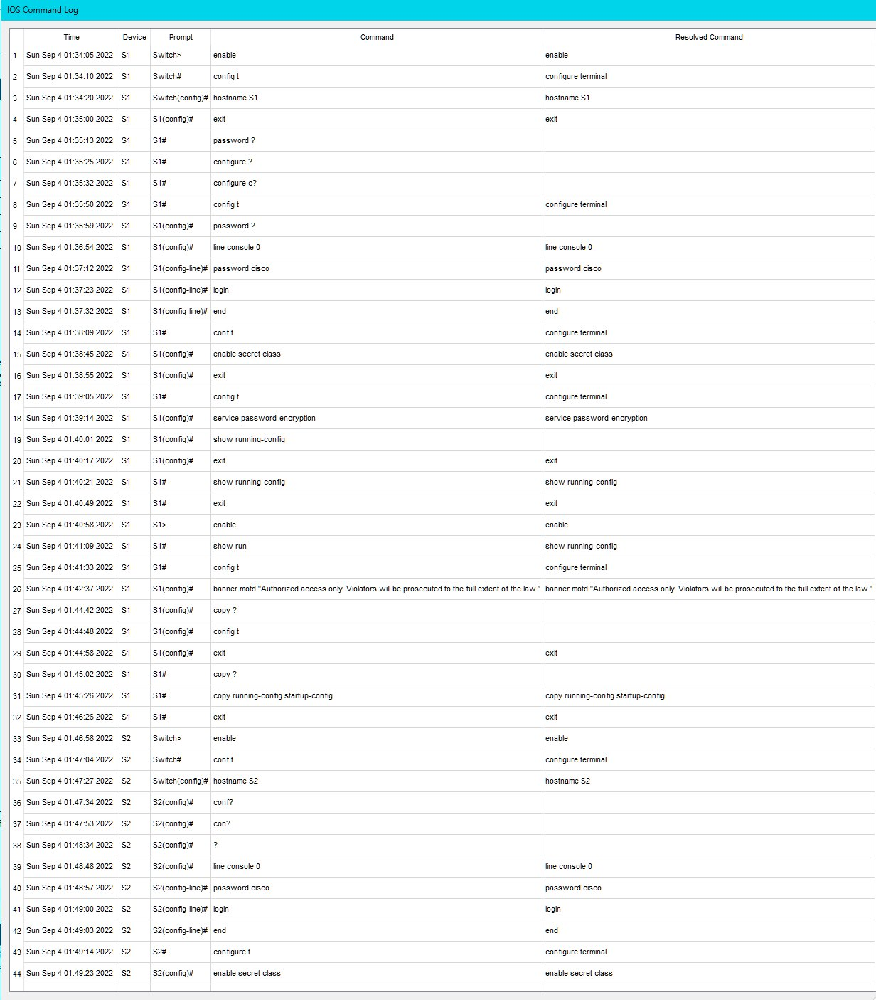

**Screenshot: Commands-2 **

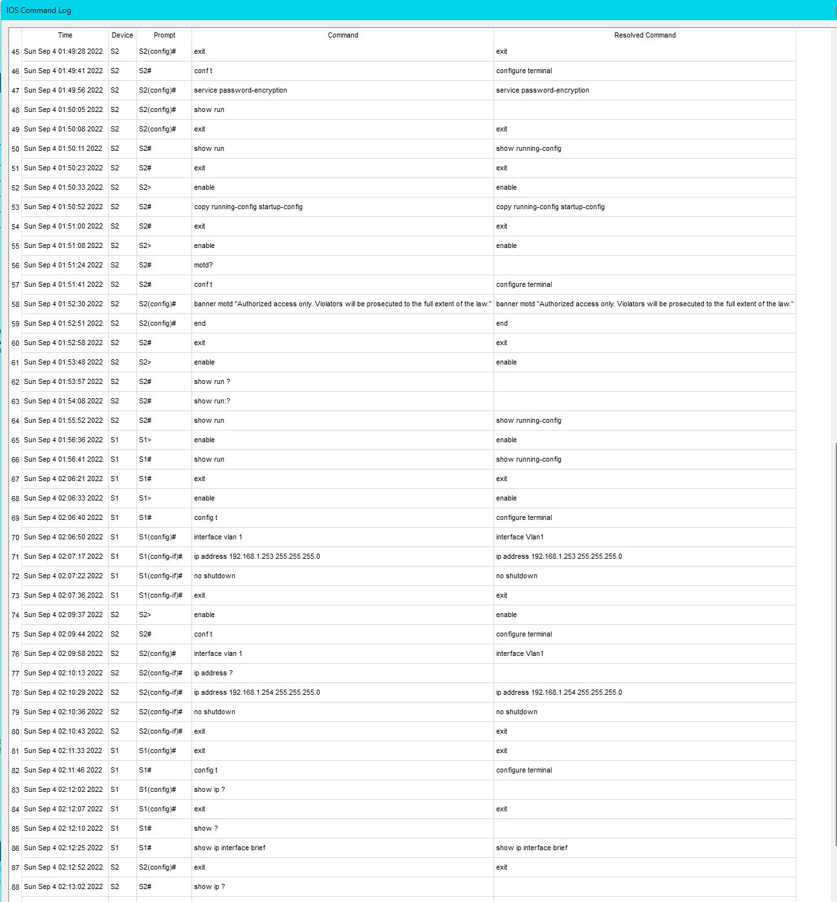

**Screenshot: Commands-3 **

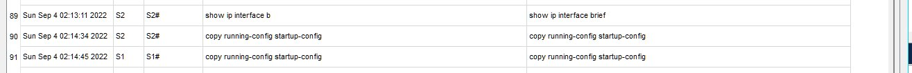


**Screenshot: Final Configuration**

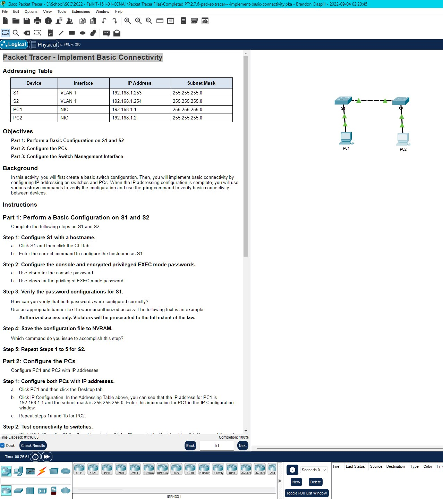
=======
# Packet Tracer - Implement Basic Connectivity

## Adressing Table

**Screenshot: Adress Table**


## Objectives

### Part 1: Perform a Basic Configuration on S1 and S2

### Part 2: Configure the PCs

### Part 3: Configure the Switch Management Interface

Background
In this activity, you will first create a basic switch configuration. Then, you will implement basic connectivity by configuring IP addressing on switches and PCs. When the IP addressing configuration is complete, you will use various <show> commands to verify the configuration and use the <ping> command to verify basic connectivity between devices.

# Instructions:

## Part 1: Perform a Basic Configuration on S1 and S2:

Complete the following steps on S1 and S2.

### Step 1: Configure S1 with a hostname:

A.     Click S1 and then click the CLI tab.

B.     Enter the correct command to configure the hostname as S1.

### Step 2: Configure the console and encrypted privileged EXEC mode passwords:

A.     Use cisco for the console password.

B.     Use class for the privileged EXEC mode password.

### Step 3: Verify the password configurations for S1:

**Screenshot: Access Password**


## Question: How can you verify that both passwords were configured correctly?

```text
To confirm that both passwords were set correctly, you'll notice two prompts when you leave user EXEC mode. The switch asks for a password when entering the console interface and again for the privileged EXEC mode. To double-check, you can use the "show run" command to see the passwords in the configuration.
```

Use an appropriate banner text to warn unauthorized access. The following text is an example:

<Authorized access only. Violators will be prosecuted to the full extent of the law.>


**Screenshot: Unauthorized Access**


### Step 4: Save the configuration file to NVRAM.

## Question: Which command do you issue to accomplish this step?

```terminal
S1(config)# exit (or end)
S1# copy run start
Destination filename [startup-config]?
Building configuration...
[OK]
S1#
```

### Step 5: Repeat Steps 1 to 5 for S2:

## Part 2: Configure the PCs:

Configure PC1 and PC2 with IP addresses.

### Step 1: Configure both PCs with IP addresses.

A.     Click PC1 and then click the Desktop tab.

B.     Click IP Configuration. In the Addressing Table above, you can see that the IP address for PC1 is 192.168.1.1 and the subnet mask is 255.255.255.0. Enter this information for PC1 in the IP Configuration window.

**Screenshot: PC-1 IP Configuration**


C.     Repeat steps 1a and 1b for PC2.

**Screenshot: PC-2 IP Configuration**


### Step 2: Test connectivity to switches.

A.     Click PC1. Close the IP Configuration window if it is still open. In the Desktop tab, click Command Prompt.

B.     Type the <ping> command and the IP address for S1 and press Enter.

```terminal
Packet Tracer PC Command Line 1.0

PC> ping 192.168.1.253

```


## Question: Were you successful? Explain.

```text
The ping is unsuccessful because the switches have not been confiured with an IP address.
```

## Part 3: Configure the Switch Management Interface:

Configure S1 and S2 with an IP address.

### Step 1: Configure S1 with an IP address.

Switches can be used as plug-and-play devices. This means that they do not need to be configured for them to work. Switches forward information from one port to another based on MAC addresses.

## Question: If this is the case, why would we configure it with an IP address?

```text
In order for you to connect remotely to a switch, you need to assign it an IP address. The default configuration on the switch is to have the management of the switch controlled through VLAN 1.
```

Use the following commands to configure S1 with an IP address.

```terminal
S1# configure terminal

Enter configuration commands, one per line. End with CNTL/Z.

S1(config)# interface vlan 1

S1(config-if)# ip address 192.168.1.253 255.255.255.0

S1(config-if)# no shutdown

%LINEPROTO-5-UPDOWN: Line protocol on Interface Vlan1, changed state to up

S1(config-if)#

S1(config-if)# exit

S1#
```

## Question: Why do you enter the <no shutdown> command?

```text
The no shutdown command administratively places the interface in an active state.
```

### Step 2: Configure S2 with an IP address.

Use the information in the Addressing Table to configure S2 with an IP address.

### Step 3: Verify the IP address configuration on S1 and S2.

Use the <show ip interface brief> command to display the IP address and status of all the switch ports and interfaces. You can also use the <show running-config> command.

### Step 4: Save configurations for S1 and S2 to NVRAM.

## Question: Which command is used to save the configuration file in RAM to NVRAM?

```command
copy running-config startup-config
```

### Step 5: Verify network connectivity.

Network connectivity can be verified using the <ping> command. It is very important that connectivity exists throughout the network. Corrective action must be taken if there is a failure. Ping S1 and S2 from PC1 and PC2.

A.     Click PC1 and then click the Desktop tab.

B.     Click Command Prompt.

C.     Ping the IP address for PC2.

D.     Ping the IP address for S1.

**Screenshot: PC-1 Ping S1**


E.     Ping the IP address for S2.

Note: You can also use the ping command on the switch CLI and on PC2.

**Screenshot: PC-2 Ping **


All pings should be successful. If your first ping result is 80%, try again. It should now be 100%. You will learn why a ping may sometimes fail the first time later in your studies. If you are unable to ping any of the devices, recheck your configuration for errors.

**Screenshot: Commands-1 **


**Screenshot: Commands-2 **


**Screenshot: Commands-3 **


**Screenshot: Final Configuration**


>>>>>>> 3f5229e468e4b557cf41cffa6cc968ba993a3ec1
