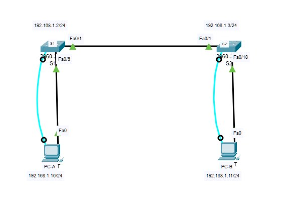
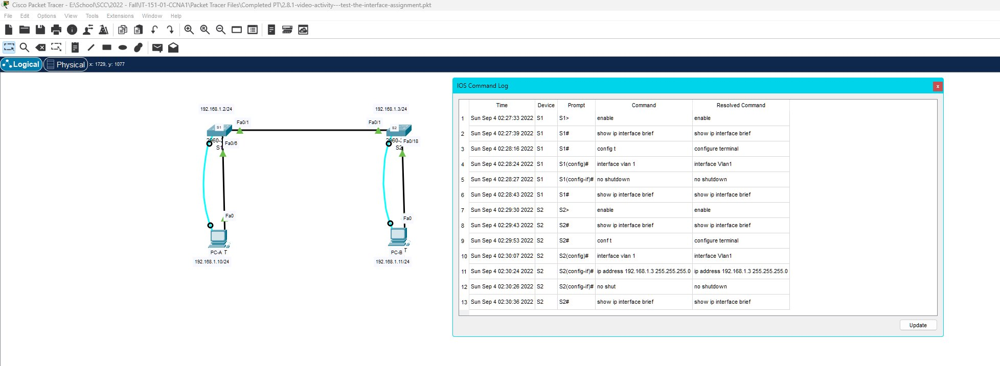

# Video Activity - Test the Interface Assignment

In the previous topic, you implemented basic connectivity by configuring IP addressing on switches and PCs. Then you verified your configurations and connectivity, because, what is the point of configuring a device if you do not verify that the configuration is working? You will continue this process in this topic. Using the CLI, you will verify the interfaces and the addresses of the switches and routers in your network.

In the same way that you use commands and utilities like ipconfig to verify the network configuration of a PC host, you also use commands to verify the interfaces and address settings of intermediary devices like switches and routers.

Click Play in the figure to view a video demonstration of the show ip interface brief command. This command is useful for verifying the condition of the switch interfaces.

Follow Along in Packet Tracer

Download the same PKT file that is used in the video. Practice using the ipconfig and show ip interface brief commands, as shown in the video.

**Screenshot: Configuration**

**Screenshot: Commands**

**Packet Tracer File:**

You can download and open the Packet Tracer simulation file for this module using the link below:

[Download Module1 Packet Tracer File](PT-files\2.8.1-video-activity---test-the-interface-assignment.pkz)