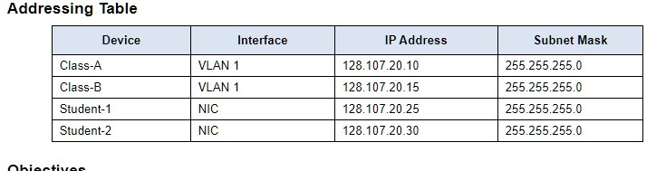
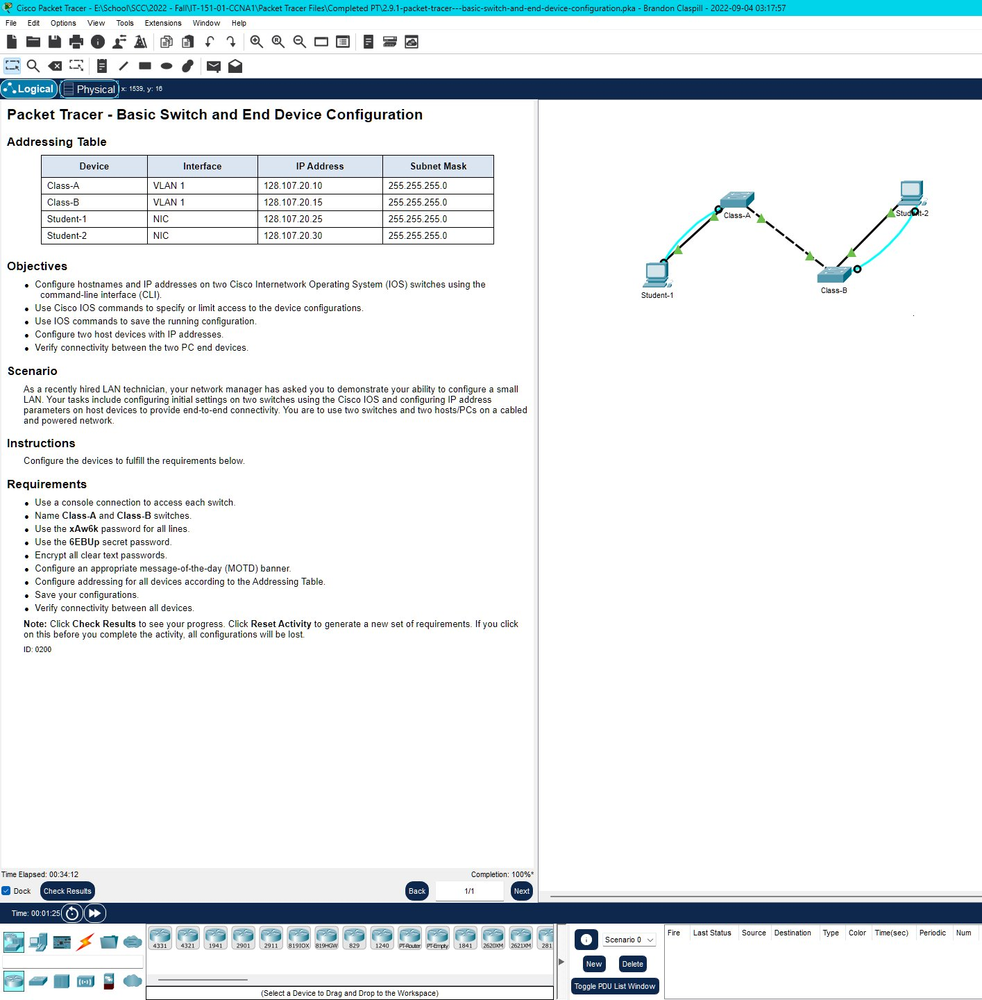
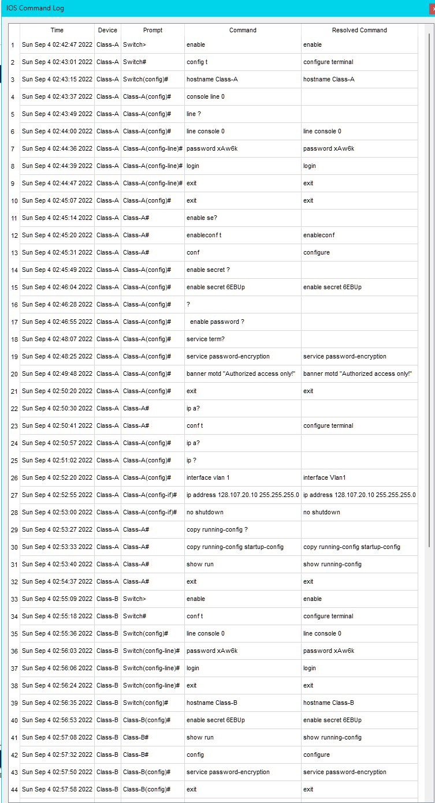
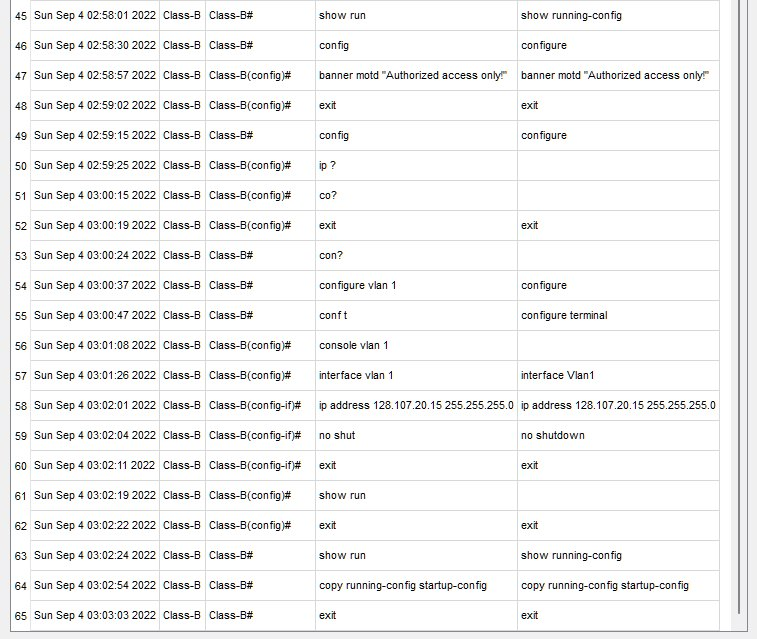

# 2.9.1 Packet Tracer – Basic Switch and End Device Configuration – 

## Addressing Table

**Screenshot: Table**

## Objectives
=   Configure hostnames and IP addresses on two Cisco Internetwork Operating System (IOS) switches using the command-line interface (CLI).

=   Use Cisco IOS commands to specify or limit access to the device configurations.

=   Use IOS commands to save the running configuration.

=   Configure two host devices with IP addresses.

=   Verify connectivity between the two PC end devices.

Scenario
As a recently hired LAN technician, your network manager has asked you to demonstrate your ability to configure a small LAN. Your tasks include configuring initial settings on two switches using the Cisco IOS and configuring IP address parameters on host devices to provide end-to-end connectivity. You are to use two switches and two hosts/PCs on a cabled and powered network.

# 
Instructions
Configure the devices to fulfill the requirements below.

Requirements
=   Use a console connection to access each switch.

=   Name Class-A and Class-B switches.

=   Use the xAw6k password for all lines.

=   Use the 6EBUp secret password.

=   Encrypt all clear text passwords.

=   Configure an appropriate message-of-the-day (MOTD) banner.

=   Configure addressing for all devices according to the Addressing Table.

=   Save your configurations.

=   Verify connectivity between all devices.

Note: Click Check Results to see your progress. Click Reset Activity to generate a new set of requirements. If you click on this before you complete the activity, all configurations will be lost.

**Screenshot: Completed Configuration**

**Screenshot: Command Logs**

