**Screenshot:Topology**

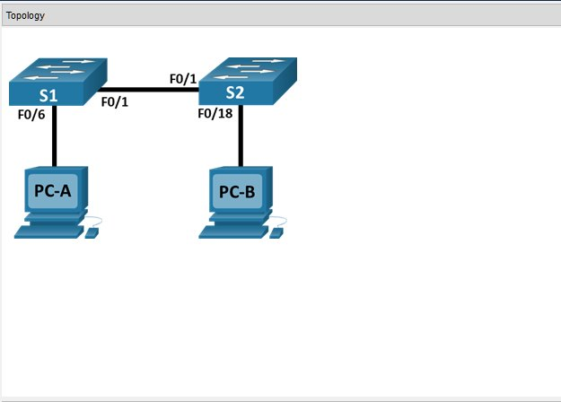


**Screenshot: Addressing Table**

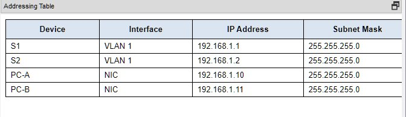

# Objectives

## Part 1: Set Up the Network Topology

## Part 2: Configure PC Hosts

## Part 3: Configure and Verify Basic Switch Settings

Background / Scenario
In this Packet Tracer Physical Mode (PTPM) activity, you will build a simple network with two hosts and two switches. You will also configure basic settings including hostname, local passwords, and login banner. Use <show> commands to display the running configuration, IOS version, and interface status. Use the <copy> command to save device configurations.

You will apply IP addressing for to the PCs and switches to enable communication between the devices. Use the <ping> utility to verify connectivity.

# Instructions:

## Part 1: Set Up the Network Topology

Power on the PCs and cable the devices according to the topology. To select the correct port on a switch, right click and select Inspect Front. Use the Zoom tool, if necessary. Float your mouse over the ports to see the port numbers. Packet Tracer will score the correct cable and port connections.

A.     There are several switches, routers, and other devices on the Shelf. Click and drag switches S1 and S2 to the Rack. Click and drag two PCs to the Table.

B.     Power on the PCs.

C.     On the Cable Pegboard, click a Copper Cross-Over cable. Click the FastEthernet0/1 port on S1 and then click the FastEthernet0/1 port on S2 to connect them. You should see the cable connecting the two ports.

D.     On the Cable Pegboard, click a Copper Straight-Through cable. Click the FastEthernet0/6 port on S1 and then click the FastEthernet0 port on PC-A to connect them.

E.     On the Cable Pegboard, click a Copper Straight-Through cable. Click the FastEthernet0/18 port on S2 and then click the FastEthernet0 port on PC-B to connect them.

F.      Visually inspect network connections. Initially, when you connect devices to a switch port, the link lights will be amber. After a minute or so, the link lights will turn green.

**Screenshot: Set Up**

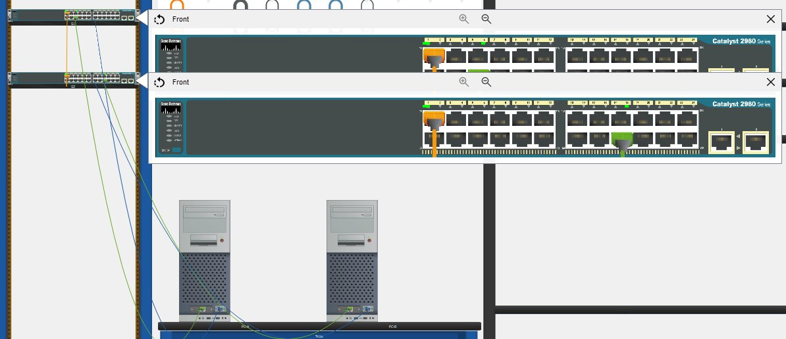

## Part 2: Configure PC Hosts

A.     Configure static IP address information on the PCs according to the Addressing Table.

B.     Click PC-A > Desktop > IP Configuration. Enter the IP address for PC-A (192.168.1.10) and the subnet mask (255.255.255.0), as listed in the IP addressing table. You can leave default gateway blank at this time because there is no router attached to the network.

**Screenshot: PC-A IP Configuration**

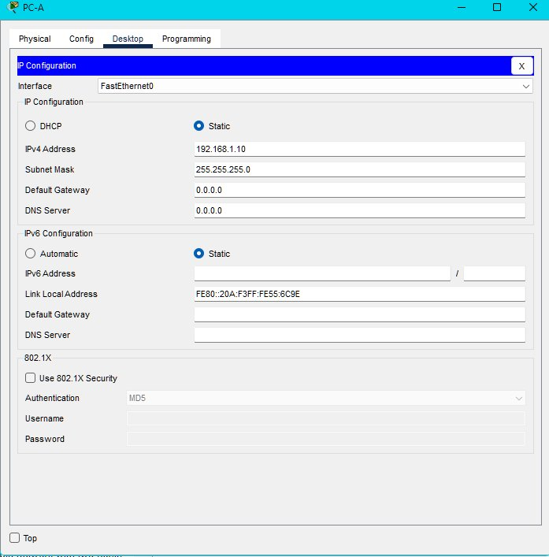

C.     Close the PC-A window.

D.     Repeat the previous steps to assign the IP address information for PC-B, as listed in the Addressing Table.

**Screenshot: PC-B IP Configuration**

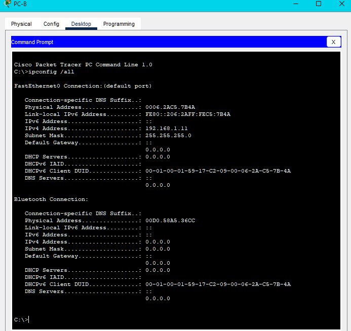

E.     Click PC-A > Desktop > Command Prompt. Use the ipconfig /all command at the prompt to verify settings.

**Screenshot: PC-A IP Configuration**

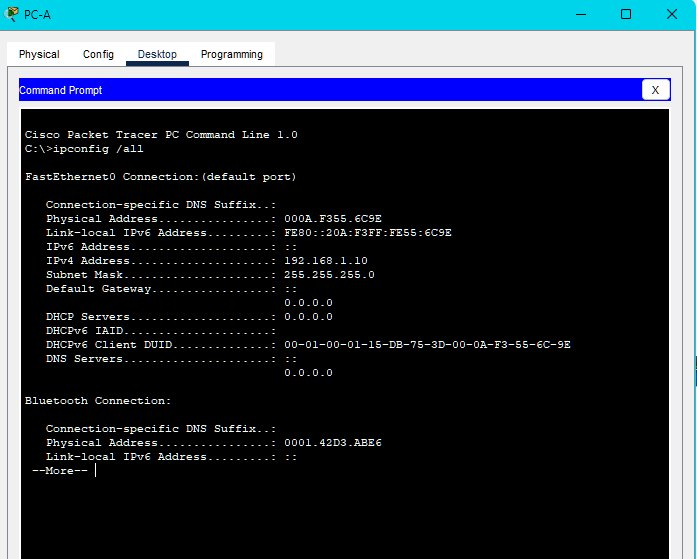

F.      Enter ping 192.168.1.11 at the prompt to test the connectivity to PC-B. The ping should be successful, as shown in the following output. If the ping is not successful, check the configurations on both of the PCs and troubleshoot as necessary.

```terminal
Packet Tracer PC Command Line 1.0

C:\> ping 192.168.1.11

 

Pinging 192.168.1.11 with 32 bytes of data:

 

Reply from 192.168.1.11: bytes=32 time<1ms TTL=128

Reply from 192.168.1.11: bytes=32 time<1ms TTL=128

Reply from 192.168.1.11: bytes=32 time<1ms TTL=128

Reply from 192.168.1.11: bytes=32 time<1ms TTL=128

 

Ping statistics for 192.168.1.11:

Packets: Sent = 4, Received = 4, Lost = 0 (0% loss),

Approximate round trip times in milli-seconds:

Minimum = 0ms, Maximum = 0ms, Average = 0ms


C:\>
```

**Screenshot: PC-A Ping**

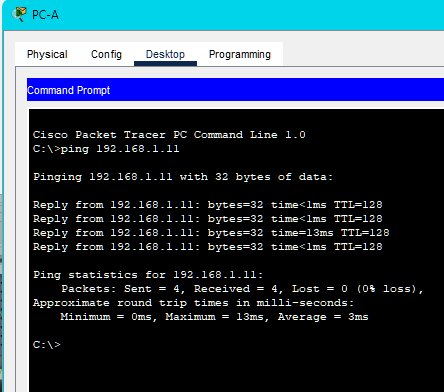

## Part 3: Configure and Verify Basic Switch Settings

A.     On the Cable Pegboard, click a Console cable. Connect the console cable between S1 and PC-A.

B.     Establish a console connection to the switch S1 from PC-A using the Packet Tracer generic Terminal program (PC-A > Desktop > Terminal). Press ENTER to get the Switch> prompt.

**Screenshot: console connection to the switch S1**

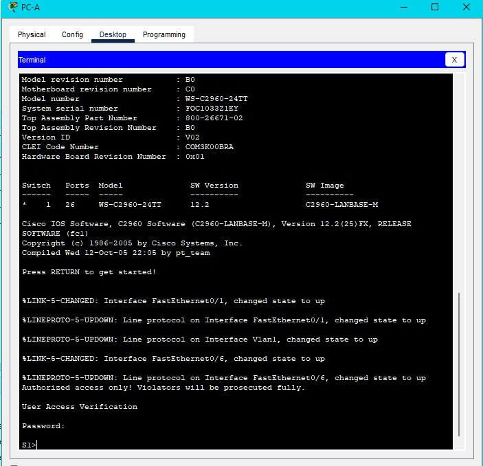

C.     You can access all switch commands in privileged EXEC mode. The privileged EXEC command set includes those commands contained in user EXEC mode, as well as the configure command through which access to the remaining command modes are gained. Enter privileged EXEC mode by entering the <enable> command.

Open Configuration Window

```terminal
Switch> enable
Switch#
```

D.     The prompt changed from Switch> to Switch# which indicates privileged EXEC mode. Enter global configuration mode.

```console
Switch# configure terminal
Enter configuration commands, one per line. End with CNTL/Z.
Switch(config)#
```

E.     The prompt changed to Switch(config)# to reflect global configuration mode. Give the switch a name according to the Addressing Table.

```console
Switch(config)# hostname S1
```

F.      Enter local passwords. Use class as the privileged EXEC password and cisco as the password for console access.

```console
S1(config)# enable secret class
S1(config)# line con 0
S1(config-line)# password cisco
S1(config-line)# login
S1(config-line)# exit

```

G.     Configure and enable the VLAN 1 interface according to the Addressing Table.
H.     A login banner, known as the message of the day (MOTD) banner, should be configured to warn anyone accessing the switch that unauthorized access will not be tolerated. Configure an appropriate MOTD banner to warn about unauthorized access.

```console
S1(config)# interface vlan 1
S1(config-if)# ip address 192.168.1.1 255.255.255.0
S1(config-if)# no shutdown
S1(config-if)# exit
S1(config)# banner motd #Unauthorized access is strictly prohibited.#
```

I.      Save the configuration to the startup file on non-volatile random access memory (NVRAM).

```console
S1# copy running-config startup-config
Destination filename [startup-config]? [Enter]
Building configuration…
[OK]
S1#
```

J.      Display the current configuration.

```console
S1# show running-config
Building configuration…
<output omitted>
S1# show startup-config
Building configuration…
<output omitted>
```

K.     Display the IOS version and other useful switch information.

```console
S1# show version
Cisco IOS Software, C2960 Software (C2960-LANBASEK9-M), Version 15.0(2)SE, RELEASE SOFTWARE (fc1)
Technical Support: http://www.cisco.com/techsupport
Copyright (c) 1986-2012 by Cisco Systems, Inc.
Compiled Sat 28-Jul-12 00:29 by prod_rel_team
<output omitted>
```

**Screenshot: Show Version**

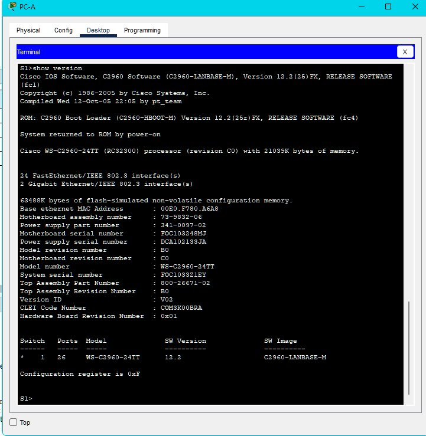

L.      Display the status of the connected interfaces on the switch.

```terminal
S1# show ip interface brief
S1#show ip interface brief
Interface              IP-Address      OK? Method Status                Protocol 
FastEthernet0/1        unassigned      YES manual up                    up 
FastEthernet0/2        unassigned      YES manual down                  down 
FastEthernet0/3        unassigned      YES manual down                  down 
FastEthernet0/4        unassigned      YES manual down                  down 
FastEthernet0/5        unassigned      YES manual down                  down 
FastEthernet0/6        unassigned      YES manual up                    up 
FastEthernet0/7        unassigned      YES manual down                  down 
FastEthernet0/8        unassigned      YES manual down                  down 
<output omitted>
GigabitEthernet0/1     unassigned      YES manual down                  down 
GigabitEthernet0/2     unassigned      YES manual down                  down 
Vlan1                  192.168.1.1     YES manual up                    up
S1#
```

**Screenshot: IP Brief**

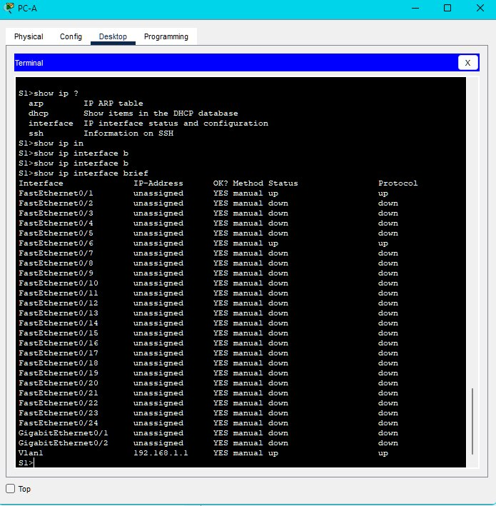

M.     Repeat the previous steps to configure switch S2. Make sure the hostname is configured as S2.

```console
enable
config terminal 
hostname S2
enable secret class
line console 0
password cisco
login
exit
interface vlan 1
ip address 192.168.1.2 255.255.255.0
no shutdown
banner motd #Unauthorized access is strictly prohibited and prosecuted to the full extent of the law.#
end
copy running-config startup-config
show running-config
show startup-config
show version
show ip interface brief
```

N.     Record the interface status for the following interfaces.

```table
Interface	S1 Status	S1 Protocol	S2 Status	S2 Protocol
F0/1	           Up	            Up              Up	            Up
F0/6	           Up	            Up	            Down      	    Down
F0/18	           Down	            Down	     Up             Up
VLAN 1	           Up	            Up	             Up	            Up
```
O. From a PC, ping S1 and S2. The pings should be successful.

**Screenshot: PC-A Ping S1 and S2**

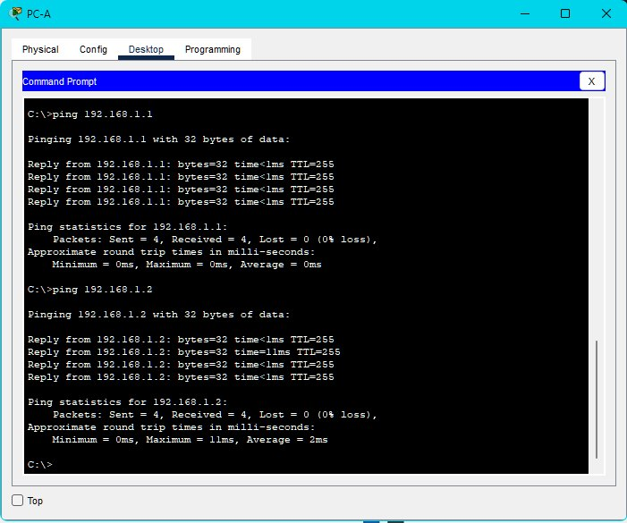

P. From a switch, ping PC-A and PC-B. The pings should be successful.

**Screenshot:  Ping PC-A and PC-B From Switch**

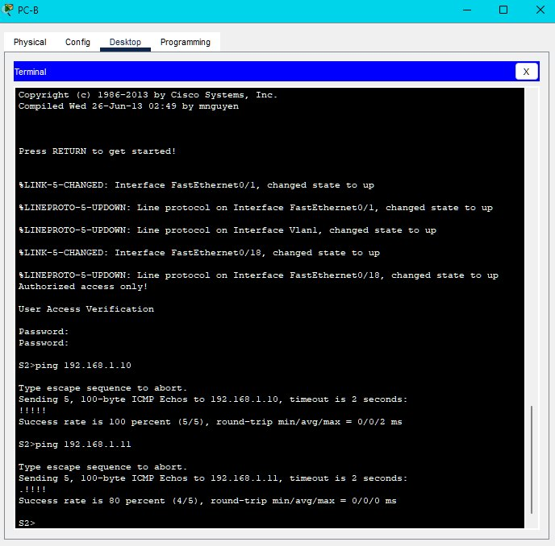

# Reflection Question

## Why are some FastEthernet ports on the switches up while others are down?

```text
The FastEthernet ports are up when cables are connected to the ports,
 unless they were manually shutdown by the administrators. Otherwise, the ports would be down.
```

## What could prevent a ping from being sent between the PCs?

```text
Wrong IP address, media disconnected, switch powered off or ports administratively down, firewall.
```

**Screenshot: Completed Configuration**

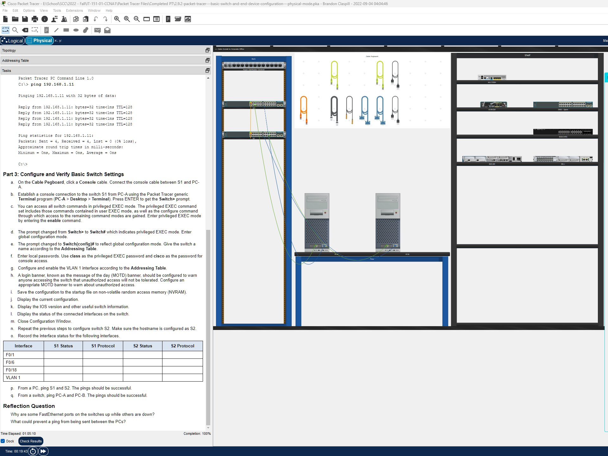

**Screenshot: Command Logs**

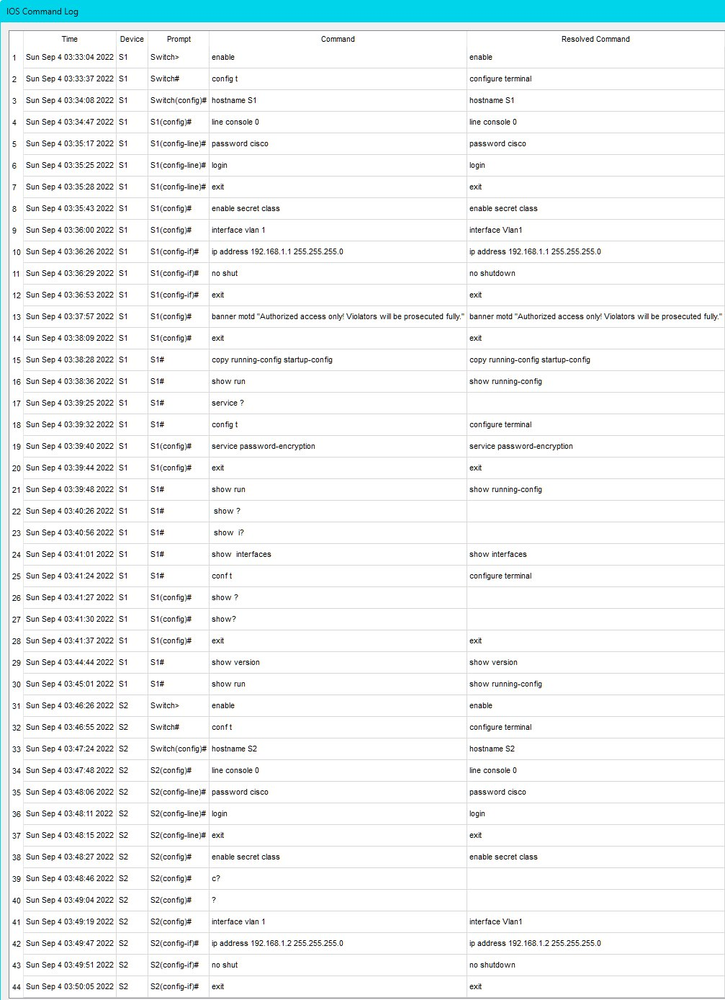

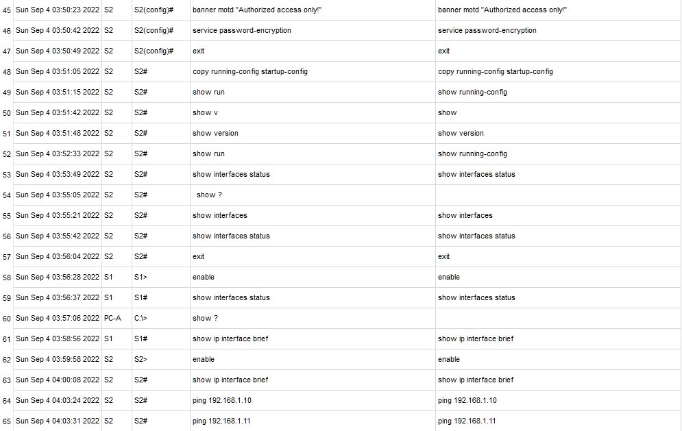
