**Screenshot: Topology**

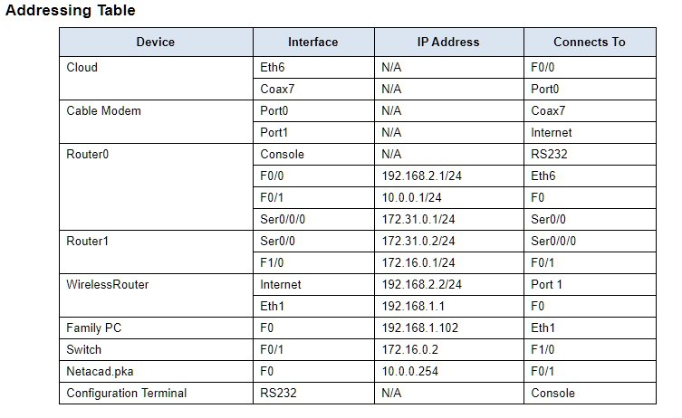

# Objectives

## Part 1: Connect to the Cloud

## Part 2: Connect Router0

## Part 3: Connect Remaining Devices

## Part 4: Verify Connections

## Part 5: Examine the Physical Topology

Background
When working in Packet Tracer (a lab environment or a corporate setting), you should know how to select the appropriate cable and how to properly connect devices. This activity will examine device configurations in Packet Tracer, selecting the proper cable based on the configuration, and connecting the devices. This activity will also explore the physical view of the network in Packet Tracer.

# Instructions

## Part 1: Connect to the Cloud

### Step 1: Connect the cloud to Router0.

A.     At the bottom left, click the orange lightning icon to open the available Connections.

B.     Choose the correct cable to connect `Router0 F0/0` to `Cloud Eth6`. Cloud is a type of switch, so use a `Copper Straight-Through` connection. If you attached the correct cable, the link lights on the cable turn green.

### Step 2: Connect the cloud to Cable Modem.

Choose the correct cable to connect Cloud Coax7 to Modem Port0.

If you attached the correct cable, the link lights on the cable turn green.

## Part 2: Connect Router0

### Step 1: Connect Router0 to Router1.

Choose the correct cable to connect Router0 Ser0/0/0 to Router1 Ser0/0. Use one of the available Serial cables.

If you attached the correct cable, the link lights on the cable turn green.

### Step 2: Connect Router0 to netacad.pka.

Choose the correct cable to connect Router0 F0/1 to netacad.pka F0. Routers and computers traditionally use the same wires to transmit (1 and 2) and receive (3 and 6). The correct cable to choose consists of these crossed wires. Although many NICs can now autosense which pair is used to transmit and receive, Router0 and netacad.pka do not have autosensing NICs.

If you attached the correct cable, the link lights on the cable turn green.

### Step 3: Connect Router0 to the Configuration Terminal.

Choose the correct cable to connect Router0 Console to Configuration Terminal RS232. This cable does not provide network access to Configuration Terminal, but allows you to configure Router0 through its terminal.

If you attached the correct cable, the link lights on the cable turn black.

## Part 3: Connect Remaining Devices

### Step 1: Connect Router1 to Switch.

Choose the correct cable to connect Router1 F1/0 to Switch F0/1.

If you attached the correct cable, the link lights on the cable turn green. Allow a few seconds for the light to transition from amber to green.

### Step 2: Connect Cable Modem to Wireless Router.

Choose the correct cable to connect Cable Modem Port1 to Wireless Router Internet port.

If you attached the correct cable, the link lights on the cable will turn green.

### Step 3: Connect Wireless Router to Family PC.

Choose the correct cable to connect Wireless Router Ethernet 1 to Family PC.

If you attached the correct cable, the link lights on the cable turn green.

## Part 4: Verify Connections

### Step 1: Test the connection from Family PC to netacad.pka.

A.     Open the Family PC command prompt and ping netacad.pka.

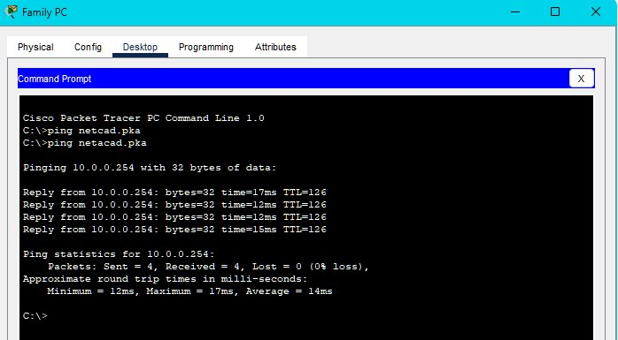

B.     Open the Web Browser and the web address http://netacad.pka.

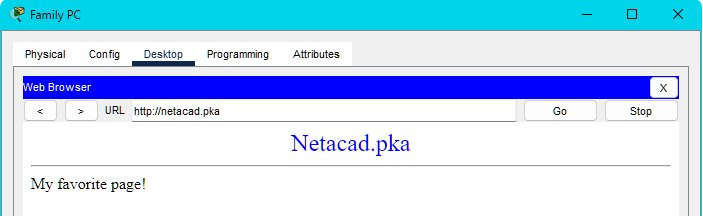

### Step 2: Ping the Switch from Home PC.

Open the Home PC command prompt and ping the Switch IP address of to verify the connection.

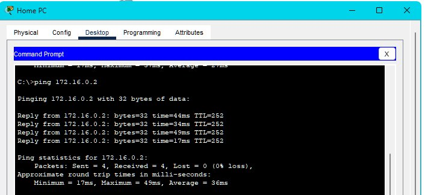

### Step 3: Open Router0 from Configuration Terminal.

A.     Open the Terminal of Configuration Terminal and accept the default settings.

B.     Press Enter to view the Router0 command prompt.

C.     Type show ip interface brief to view interface statuses.

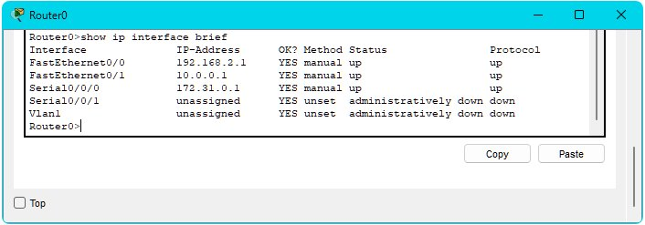

## Part 5: Examine the Physical Topology

### Step 1: Examine the Cloud.

A.     Click the Physical Workspace tab or press Shift+P and Shift+L to toggle between the logical and physical workspaces.

B.     Click the Home City icon.

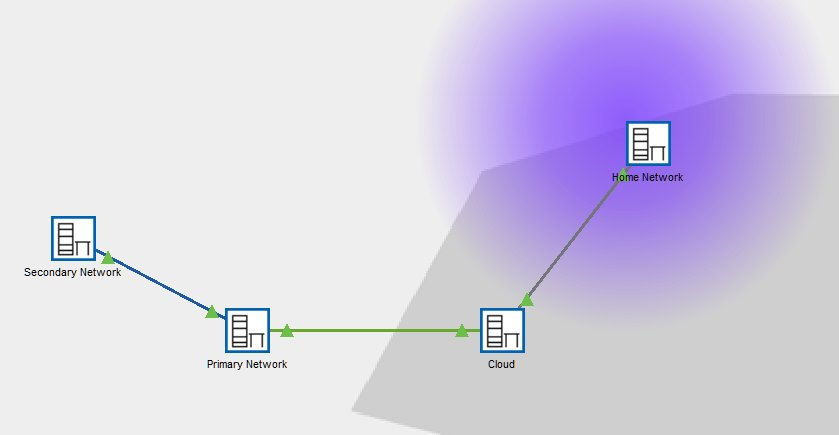

C.     Click the Cloud icon.

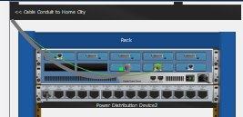

## Question: How many wires are connected to the switch in the blue rack?

D.     Click Back to return to Home City.

### Step 2: Examine the Primary Network.

A.     Click the Primary Network icon. Hold the mouse pointer over the various cables.

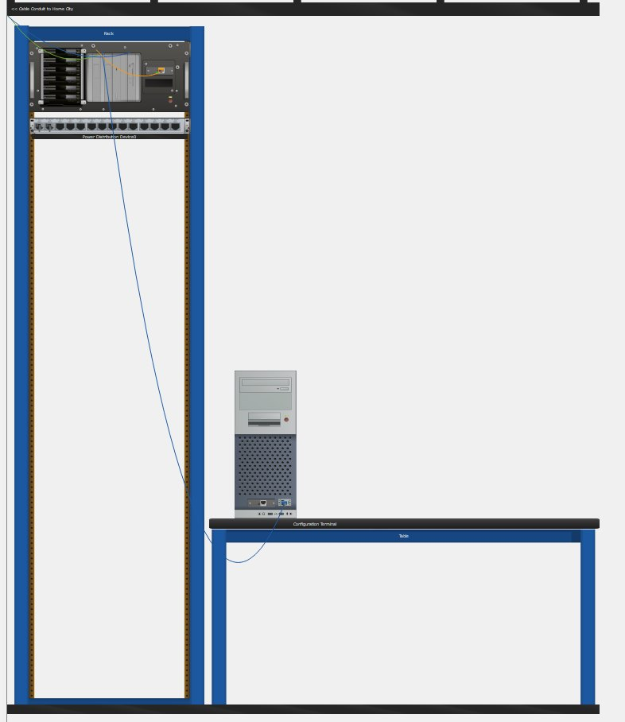

## Question: What is located on the table to the right of the blue rack?

B.     Click Back to return to Home City.

### Step 3: Examine the Secondary Network.

A.     Click the Secondary Network icon. Hold the mouse pointer over the various cables.

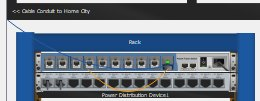

## Question: Why are there two orange cables connected to each device?

B.     Click Back to return to Home City.

### Step 4: Examine the Home Network.

A.     Click the Home Network icon.

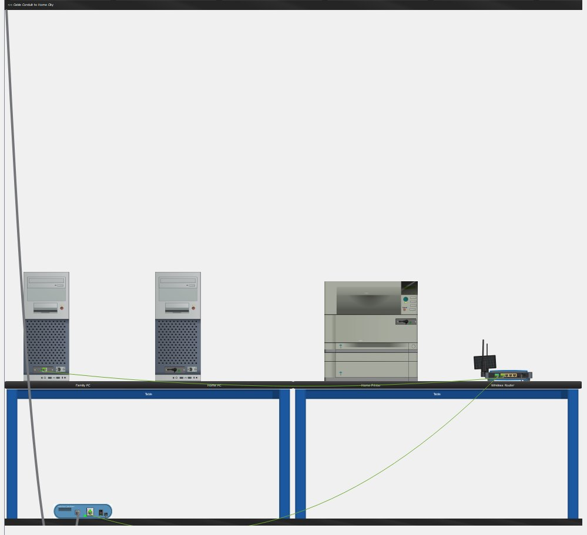

## Question: Why is there no rack to hold the equipment?

B.     Click the Logical Workspace tab to return to the logical topology.

**Screenshot: Completed Configuration**

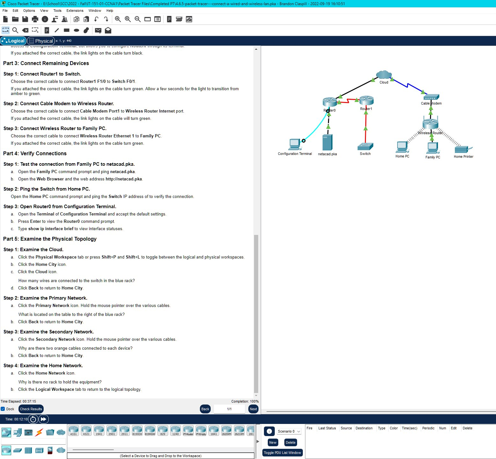

**Packet Tracer File:**

You can download and open the Packet Tracer simulation file for this module using the link below:

[Download Module1 Packet Tracer File](files\4.6.5-Connect-a-wired-and-wireless-LAN.pkz)