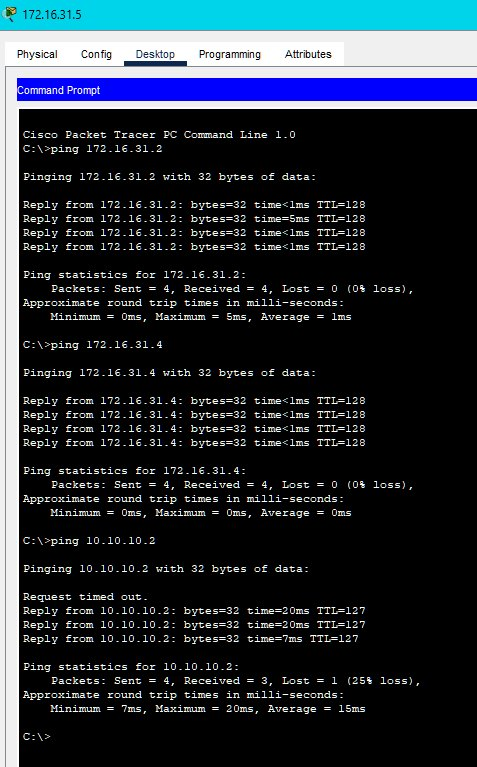

[PDF](files\PT 9.1.3.docx)

<!-- insert just before the closing body tag </body> -->

## Embedded Spreadsheet
<iframe src="https://docs.google.com/spreadsheets/d/e/2PACX-1vRZj7GenylDEglCsglInEADnFIzrR-ORquJAcIhVgw0NdtSz3ASDFXVLVYWuy6q5EzPNUWC5ecH4WAl/pubhtml?widget=true&amp;headers=false"></iframe>

## Embedded PDF

<iframe src="https://docs.google.com/document/d/e/2PACX-1vR24VtsPkZf4VB_-Q-sHWpWQqkFp0rvhjrzQQyByrdhlJVMshzjfWNM9gQ6u9uGfA/pub" width="100%" height="600px"></iframe>

# 9.1.3 Packet Tracer - Identify MAC and IP Addresses

*** Screenshot Final Config ***

**Packet Tracer File:**

You can download and open the Packet Tracer simulation file for this module using the link below:

[Download Module1 Packet Tracer File](files/9.1.3-packet-tracer---identify-mac-and-ip-addresses.pka)
