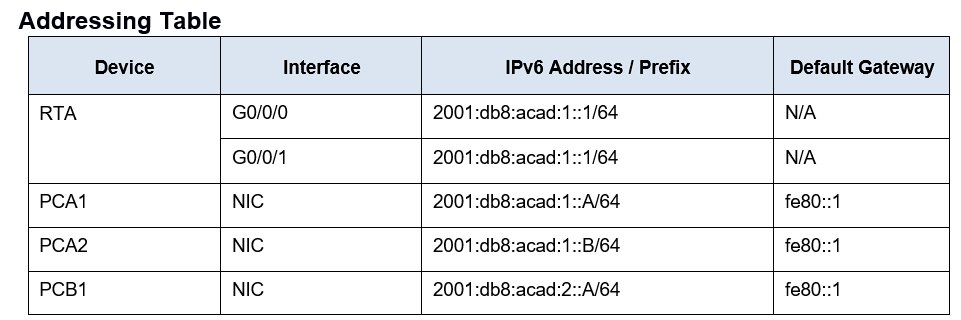
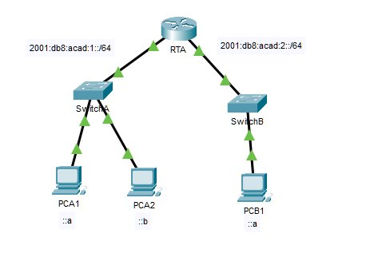

# Packet Tracer – IPv6 Neighbor Discovery 

**Addressing Table**


## Objectives 

- ### Part 1: IPv6 Neighbor Discovery Local Network 

- ### Part 2: IPv6 Neighbor Discovery Remote Network  

Background:

In order for a device to communicate with another device, the `MAC Address` of the destination must be known. With IPv6, a process called Neighbor Discovery using `NDP` or `ND Protocol` is responsible for determining the destination `MAC Address`. You will gather `PDU` information in simulation mode to better understand the process. There is no Packet Tracer scoring for this activity. 



# Instructions 

## Part 1: IPv6 Neighbor Discovery Local Network:

In Part 1 of this activity, you will obtain the `MAC Address` of a `Destination` device on the same network. 

### Step 1: Check the router for any neighbors that it discovered. 

- A.	Click the `RTA Router`. Select the `CLI Tab` and issue the command `Show ipv6 neighbors` from the Privileged EXEC Mode`. If 
there are any entries displayed, remove them using the command clear ipv6 neighbors.  

- B.	Click `PCA1`, select the `Desktop Tab` and click the `Command Prompt` Icon. 

### Step 2: Switch to Simulation Mode to capture events. 

- C.	Click the `Simulation` Button in the lower right corner of the Packet Tracer Topology window. 
  
- D.	Click the `Show All/None` Button in the lower left part of the `Simulation Panel`. Make certain `Event List Filters` – Visible Events displays `None`. 
  
- E.	From the `Command Prompt` on `PCA1`, Issue the command `ping –n 1 2001:db8:acad:1::b`. This will start the process of pinging `PCA2`. 
  
- F.	Click the `Play Capture Forward` Button, which is displayed as an arrow pointing to the right with a vertical bar within the Play Controls box. The status bar above the Play Controls should read `Captured to 150`. 
(The exact number may vary.) 

- G.	Click the `Edit Filters` Button. Select the `IPv6 Tab` at the top and check the boxes for `ICMPv6` and `NDP`. Click the `Red X` in the upper right of the `Edit ACL Filters` Window. The captured events should now be listed. You should have approximately 12 entries in the window. 

## Question: Why are ND PDUs present? 

```text
There are ND PDU’s present, because as stated above a MAC Address destination must be known for devices to communicate. So, this is showing how the IPv6 ND appears, in order to get the MAC Address information of its destination. In this scenario, the ND would be starting the process of accessing PCA2’s MAC Address in order to start the communication of the ping I requested.
```

- H.	Click the `Square` in the `Type Column` for the first event, which should be `ICMPv6`. 
  
## Question: Because the message starts with this event there is only an Outbound PDU. Under the OSI Model tab, what is the Message Type listed for ICMPv6?

```text     
 Message Type - 128
```

Notice there is no `Layer 2` addressing. Click the `Next Layer >>` button to get an explanation about the `ND` (Neighbor Discovery) process.  

- I.	Click the square next to the next event in the `Simulation Panel`. It should be at `Device PCA1` and the type should be `NDP`. 

## Questions: What changed in the Layer 3 addressing? 

```text
The Dest. IP changed to FF02::1:FF00:B and also the ICMPv6 Neighbor Message Type change from 128 to a Neighbor Message Type of 135.
```

## Question: What Layer 2 addresses are shown? 

```text
Addresses showing in Layer 2 are the Source Address 0001.427E.E8ED and Destination Address 3333.FF00.000B.
```

When a host does not know the `MAC Address` of the destination, a Special `Multicast MAC Address` is used by `IPv6 Neighbor Discovery` as the `Layer 2` destination address. 

- J.	Select the first `NDP` event at `SwitchA`. 
  
## Question: Is there any difference between the In Layers and Out Layers for Layer 2?

```text
NO
```

- K.	Select the `First NDP` event at `PCA2`. Click the `Outbound PDU` Details. 
  
## Question: What addresses are displayed for the following? 

Note: The addresses in the fields may be wrapped, adjust the size of the PDU window to make address information easier to read. 

Ethernet II DEST ADDR:

```text
0001.427E.E8ED
```

Ethernet II SRC ADDR: 

```text
0040.0B02:.243E 
```

IPv6 SRC IP: 

```text
2001:db8:acad:1::b 
```

IPv6 DST IP: 

```text
2001:db8:acad:1::ae 
```

## Question: Select the first NDP event at RTA. Why are there no Out Layers? 

```text
-	The Neighbor Solicitation's target IPv6 address does not match the receiving port's IPv6 address.
-	 The NDP process drops the packet.
```

- M.	Click through the `Next Layer >>` button until the end and read steps 4 through 7 for further explanation. 

- N. Click the Next `ICMPv6` event at `PCA1`. 

## Question: Does PCA1 now have all of the necessary information to communicate with PCA2? 

```text
Yes there Is now the Destination IPv6 Address and the Destination MAC Address of PCA2 listed in Layer 2. So, there is enough information for PCA1 to communicate with PCA2 at this point.
```

- O.	Click the last `ICMPv6` event at `PCA1`. Notice this is the last communication listed. 
  
## Question: What is the ICMPv6 Echo Message Type? 

```text
ICMPv6 Echo Message Type is 129, an echo reply message.
```

- P.	Click the `Reset Simulation` button in the `Simulation Panel`. From the command prompt of `PCA1` repeat the `ping to PCA2`. (Hint: you should be able to press the up arrow to bring the previous command back.) 
  
- Q.	Click the `Capture Forward` button `5` times to complete the `ping process`. 

## Question: Why weren’t there any NDP events? 

```text
This is now the second ping communicated to the same device, PCA1 to PCA2 so PCA1 now already knows the MAC Address for PCA2. Which means there is no need for Neighbor Discovery to be utilized in this scenario.
```

# Part 2: IPv6 Neighbor Discovery Remote Network 

In Part 2 of this activity, you will perform steps that are similar to those in Part 1, except in this case, the destination host is on another LAN. Observe how the Neighbor Discovery process differs from the process you observed in Part 1. Pay close attention to some of the additional addressing steps that take place when a device communicates with a device that is on a different network. 
Make sure to click the Reset Simulation button to clear out the previous events.  

### Step 1: Capture events for remote communication. 

-    A.	Display and clear any entries in the `IPv6` neighbor device table as was done in Part I.
   
-    B.	Switch to `Simulation Mode`. Click the `Show All/None` button in the lower left part of the Simulation Panel. Make certain the `Event List Filters – Visible Events` displays `None`. 
  
-    C.	From the `Command Prompt` on `PCA1` issue the command `Ping –n 1 2001:db8:acad:2::a` to `ping` host `PCB1`.  
  
-    D.	Click the `Play Capture Forward` button which is displayed as an arrow pointing to the right with a vertical bar within the Play Controls box. The status bar above the Play Controls should read Captured to 150. (The exact number may vary.) 
  
-    E.	Click the `Edit Filters` button. Select the `IPv6` tab at the top and check the boxes for `ICMPv6` and `NDP`. Click the `Red X` in the upper right of the `Edit ACL Filters` window. All of the previous events should now be listed. You should notice there are considerably more entries listed this time. 

-    F.	Click the Square in the Type Column for the first event, which should be `ICMPv6`. Because the message starts with this event, there is only an `Outbound PDU`. Notice that it is missing the `Layer 2 Information` as it did in the previous scenario. 

-    G.	Click the first `NDP` event At `Device PCA1`. 

## Question: What address is being used for the Src IP in the inbound PDU? 

```text
The Link Layer address for PCA1 – FE80::201:42FF:FE7E:E8ED
``` 
IPv6 Neighbor Discovery will determine the next destination to forward the ICMPv6 message. 

-    H.	Click the `Second ICMPv6` event for `PCA1`. `PCA1` now has enough information to create an `ICMPv6` `echo request`. 
  
## Question: What MAC address is being used for the destination MAC? 

```text
The MAC Address being used is the Routers (RTA) and is -  0001.961d.6301
```

-    I.	Click the next `ICMPv6` event at device `RTA`. Notice that the `Outbound PDU` from `RTA` lacks the destination `Layer 2` address, This means that RTA once again has to perform a Neighbor Discovery for the interface that has the `2001:db8:acad:2::` network because it doesn’t know the `MAC addresses` of the devices on the `G0/0/1 LAN`. 

-    J.	Skip down to the first `ICMPv6` event for device `PCB1`. 

## Question: What is missing in the outbound Layer 2 information? 

```text
Once again the Layer 2 Destination MAC Address is unknown, so there is no information in this layer at this point. The IPv6 Destination Address needs to be associated with the Destination MAC Address.
```

-    K.	The next few `NDP` events are associating the remaining `IPv6 addresses` to `MAC Addresses`. The previous `NDP` events associated `MAC Addresses` with `Link Local Addresses`. 
    
-    L.	Skip to the last set of `ICMPv6` events and notice that all of the addresses have been learned. The required information is now known, so `PCB1` can send echo reply messages to `PCA1`. 

-    M.	Click the Reset Simulation button in the Simulation Panel. From the command prompt of `PCA1` repeat the command to ping PCB1.  

-    N.	Click the Capture Forward button nine times to complete the ping process. 

## Question: Were there any NDP events? 

```text
No, because they have communicated before, so the Destination MAC Address is known.
``` 

O.	Click the only `PCB1` event in the new list. 

## Questions: What does the destination MAC address correspond to? 

```text
The Destination MAC Address corresponds to (RTA) which is the Routers G0/0/1 Interface.
``` 

## Question: Why is PCB1 using the router interface MAC address to make its ICMP PDUs? 

```text
PCB1 is using the RTA MAC Address because the Destination is not inside its local network. Which means it is outside the network and the Router needs to come into the equation. The PCB1 address the Router, and then the Router determines the next path to take outside the network. 
``` 

## Step 2: Examine router outputs. 

A.	Return to `Realtime mode`. 

B.	Click `RTA` and select the `CLI Tab`. At the router prompt enter the command `show ipv6 neighbors`. 

## Question: How many addresses are listed? 

```text
There are now 4 addresses listed in the RTA table.
``` 

## Question: What devices are these addresses associated with? 

```text
These addresses are associated with the most recent device communication and correspond to PCA1 and PCB1 devices.
```

## Question: Are there any entries for PCA2 listed (why or why not)? 

```text
No there is not a current entry listed for device PCA2 yet because there hasn’t been any communication with the device.
```

'Ping PCA2 from the router'


C.	Issue the `show ipv6 neighbors` command. 


## Question: Are there entries for PCA2? 

```text
Yes, the MAC and IPv6 Address of PCA2 are now in the RTA table.
```

## Reflection Questions 

## 1.	When does a device require the IPv6 Neighbor Discovery process? 

```text
When the DESTINATION MAC Address is not recognized. 
```

## 2.	How does a router help to minimize the amount of IPv6 Neighbor Discovery traffic on a network? 

```text
By keeping a log of entries, the router minimizes the need for ND and increase traffic on a network. The known addresses are stored in the routers table so it can quickly reference it when known devices are trying to communicate. Which reduces the need for ND to be utilized therefor decreasing traffic over the network.
```

## How does IPv6 minimize the impact of the ND process on network hosts?

```text
By using a multicast address it significantly reduces the impact of ND because a lot fewer addresses are actively listening to the Neighbor Discovery messages.  Also, hosts do not have to go through as many protocols and can easily determine if they are the intended target. So, it makes the hosts not have to work as hard to analyze and verify if they are the target. 
```

## 3.	How does the Neighbor Discovery process differ when a destination host is on the same LAN and when it is on a remote LAN? 

```text
When the device is local, the host responds and there then can be direct communication. In remote networks there is additional steps of the source host sending the packet to the router, then the router locates the destination hosts router, and they communicate. Then finally the destination host can be located by the router in that network and then relay its MAC Address back. So basically the main difference is that when a frame is sent to another device on the same local network, the device sending the frame will use the MAC address of the destination device. When sending a frame to another device on a remote network, the device sending the frame will use the MAC address of the local router interface, which is the default gateway. 
```

**Packet Tracer File:**

You can download and open the Packet Tracer simulation file for this module using the link below:

[Download Module1 Packet Tracer File](files\9.3.4-IPV6-neighbor-discovery.pka)